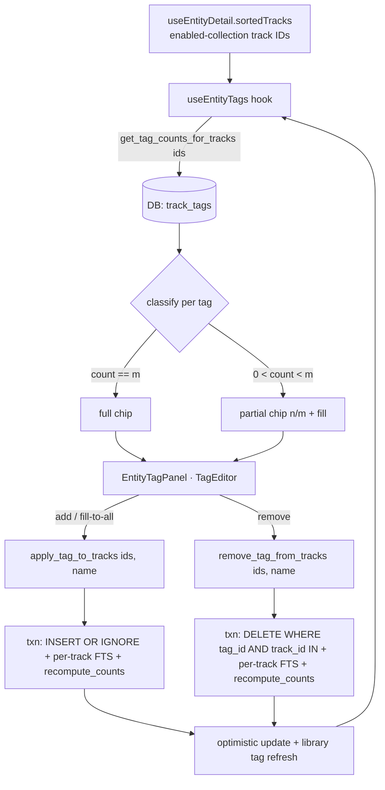

# feat: Album / Artist Tag Panel

## Summary

Add an editable Tags panel to the album and artist detail pages. The panel aggregates the union of tags across the entity's tracks (full chip = on all; partial chip with `n of m` count = on some) and lets the user apply, fill-to-all, or remove a tag across the whole track set in one action. All writes are DB-only and optimistic. The work is two net-new batched Tauri commands plus a frontend hook, a backward-compatible extension to `TagEditor`, and a panel wired into both detail pages.

## Problem Frame

Tagging a whole album or artist is tedious today: the only route is to open the detail page, multi-select the track list, right-click, and run Bulk Edit — and no surface shows what tags an entity's tracks already carry. The single-track quick-edit commands can't be reused at scale (`replace_track_tags` rebuilds the entire FTS index on every call), and the only batched path that exists (`bulk_update_tracks`) writes genre into audio files, which the brainstorm explicitly rules out. So the feature needs its own DB-only batched commands and an aggregation read (see origin: `docs/brainstorms/2026-06-16-album-artist-tag-panel-requirements.md`).

---

## Requirements

Carried from the origin requirements doc (R1–R11) plus two plan-level correctness contracts (R12–R13).

**Display & aggregation**

- R1. The album and artist detail pages render a Tags panel listing the distinct union of tags across that entity's tracks.
- R2. Each tag shows coverage: a full chip when every track carries it, or a muted partial chip with an `n of m` count when only some do.

**Editing**

- R3. Adding a tag applies it to all of the entity's tracks (DB-only).
- R4. Removing a tag (the X) removes it from every track of the entity that currently carries it (DB-only).
- R5. A partial chip offers a one-click fill-to-all that applies the tag to the tracks missing it.
- R6. All panel edits are optimistic with revert-on-failure; every `catch` logs via `console.error`.
- R7. Panel edits never write audio-file genre metadata.

**Navigation, suggestions, reuse**

- R8. Clicking a chip's label opens that Tag's detail page.
- R9. The panel uses the shared `TagEditor` and the shared suggestion pool (library tags ranked by usage plus community tags).
- R10. The album panel operates on that album's tracks; the artist panel operates on the artist's entire track set across all albums — the same set the detail page lists.

**Consistency**

- R11. Applying or removing tags via the panel refreshes the affected tags' `track_count` so the Library tags tab and Tag detail reflect the change without an app restart.

**Plan-level correctness contracts (not in origin)**

- R12. Aggregation (the `n of m` denominator) and the writes operate on the identical enabled-collection track-ID set the detail page loads — they never diverge.
- R13. Each batched apply/remove runs as a single DB transaction, so a failure leaves no partial application and the optimistic UI reverts cleanly.

---

## Key Technical Decisions

- **Net-new batched DB-only commands, not reuse of single-track commands.** `apply_tag_to_tracks` and `remove_tag_from_tracks` each run one transaction over a track-ID set. Looping `replace_track_tags` is rejected — it calls `rebuild_fts()` (full FTS table rebuild) per track, which is pathological across an artist's catalog. `bulk_update_tracks` is rejected — it writes genre into audio files (violates R7). The additive-only `plugin_apply_tags_bulk` exists but has no remove counterpart and no count refresh.
- **`recompute_counts()` after each batched write.** This is the count-refresh path for R11; the quick-edit tag commands skip it today. It is consistent with `bulk_update_tracks` (which already calls it on every save) and also reaps tags whose count drops to zero (it deletes orphan tag rows). A targeted per-tag count helper is a deferred optimization, not needed for correctness.
- **Same track-ID set for aggregation and writes (R12).** Both read from `useEntityDetail().sortedTracks`, which already applies `ENABLED_COLLECTION_FILTER` and, for artists, already spans all albums. Using one set closes the divergence trap where a disabled-collection track carrying the tag would make the panel show a false "full" state or leave a tag behind on remove.
- **Extend `TagEditor`, don't reimplement chips.** Add optional, backward-compatible props (`partialTags`, `onFillToAll`, `onChipLabelClick`) so partial chips, the fill affordance, and label-click navigation live in the shared component per the Tag Operations reuse convention. Existing hosts (`BulkEditModal`, `TagPopover`) pass none of these and render byte-for-byte as before.
- **Cross-surface live sync is out of scope.** The panel re-aggregates on open and whenever the detail page's track list reloads; it does not subscribe to tag edits made on other surfaces mid-session. Live propagation would require a new tag event on `trackEvents` wired into all four tag surfaces — deferred (see Scope Boundaries).
- **Diacritic/case dedup relies on the backend.** `get_or_create_tag` already normalizes via `strip_diacritics(unicode_lower())`, so `Jazz` merges into an existing `jazz`. The panel displays the canonical casing returned by aggregation and normalizes the client-side optimistic add the same way to avoid a chip flicker on merge.

---

## High-Level Technical Design

Data flow for one panel session. Aggregation and writes share the entity's track-ID set; every write ends in a count refresh and a re-aggregate.

---

## Implementation Units

### U1. Backend: tag-count aggregation read command

- **Goal:** One query returns, for a set of track IDs, each tag's id, name, and count among those tracks — enough to classify full vs partial without per-track fan-out.
- **Requirements:** R1, R2, R12
- **Dependencies:** none
- **Files:** `src-tauri/src/db/tags.rs` (new `get_tag_counts_for_tracks`), `src-tauri/src/commands/library.rs` (new `#[tauri::command]` wrapper), `src-tauri/src/lib.rs` (register in BOTH `generate_handler!` lists — the `#[cfg(debug_assertions)]` and `#[cfg(not(debug_assertions))]` handlers — and verify with `cargo check --release`), tests in `src-tauri/src/db/tags.rs` `#[cfg(test)]`.
- **Approach:** `SELECT tg.id, tg.name, COUNT(*) FROM track_tags tt JOIN tags tg ON tg.id = tt.tag_id WHERE tt.track_id IN (...) GROUP BY tg.id`. Return `Vec<(i64, String, i64)>`. Caller passes the entity's track IDs (already collection-filtered upstream); the command does not re-derive the set. Chunk the `track_id IN (...)` binding at 500 ids (mirror `update_track_column` in `src-tauri/src/db/collections.rs`) and sum counts across chunks, so a prolific artist doesn't exceed SQLite's bound-parameter limit. Empty input returns an empty vec.
- **Patterns to follow:** existing read methods in `src-tauri/src/db/tags.rs` (`get_tags`, `get_tags_for_track`); parameter-binding for `IN (...)` lists as used elsewhere in the db layer.
- **Test scenarios:**
  - Three tracks, tag on all three → returns count 3 for that tag.
  - Tag on 2 of 3 tracks → returns count 2 (the partial case the frontend renders as `2 of 3`).
  - Track with no tags / empty track-ID list → tag absent / empty result.
  - Two tags with different coverage in one call → both returned with correct independent counts.
  - Artist with >500 tracks across albums → chunked aggregation returns correct summed counts (a single `IN (...)` would exceed SQLite's bound-parameter limit).
  - `Covers AE1, AE2.`
- **Verification:** `cargo test` for the new db tests pass; a sample call over a known fixture returns the expected `(id, name, count)` triples.

### U2. Backend: batched DB-only apply / remove commands

- **Goal:** Apply or remove one tag across a track-ID set in a single transaction, update FTS per track, and refresh affected tag counts — without touching audio files.
- **Requirements:** R3, R4, R5, R7, R11, R13
- **Dependencies:** none (parallel with U1)
- **Files:** `src-tauri/src/db/tags.rs` (new `apply_tag_to_tracks`, `remove_tag_from_tracks`), `src-tauri/src/db/tracks.rs` (reuse the per-track FTS update helper used by `apply_tags_bulk`; call `recompute_counts`), `src-tauri/src/commands/library.rs` (two `#[tauri::command]` wrappers), `src-tauri/src/lib.rs` (register both commands in BOTH `generate_handler!` lists — debug and release — verify with `cargo check --release`), tests in `src-tauri/src/db/tags.rs` `#[cfg(test)]`.
- **Approach:** apply → reuse the existing `apply_tags_bulk` (build `assignments` of `(id, [name])` per id — it already does `get_or_create_tag` + `INSERT OR IGNORE` + per-track FTS in one transaction; do not re-implement that body), then call `recompute_counts()`. remove → new `DELETE FROM track_tags WHERE tag_id = ? AND track_id IN (...)` in one transaction with per-track FTS refresh, then `recompute_counts()` so counts are correct and zero-count tags are reaped. Chunk every `track_id IN (...)` / assignment batch at 500 ids (mirror `update_track_column` in `src-tauri/src/db/collections.rs`). Do NOT call `rebuild_fts()` per track. Return the canonical tag name (apply) so the frontend can reconcile casing on merge.
- **Patterns to follow:** `apply_tags_bulk` transaction shape in `src-tauri/src/db/tracks.rs`; `get_or_create_tag` in `src-tauri/src/db/tags.rs`; `recompute_counts` call sites (e.g. inside `bulk_update_tracks`).
- **Test scenarios:**
  - Apply tag to 3 tracks → 3 `track_tags` rows; tag `track_count` == 3 after the call.
  - Apply when 1 of 3 already has it (fill-to-all) → idempotent, ends at 3 rows, no duplicate.
  - Remove tag from the 2 tracks that carry it → rows gone; if that was the tag's last usage, `recompute_counts` deletes the orphan tag row (so `get_tags`' `WHERE track_count > 0` no longer lists it).
  - Apply `Jazz` when `jazz` exists → merges into the existing tag (one tag id), returns canonical `jazz`.
  - Empty track-ID list → no-op, Ok.
  - Apply/remove across >500 tracks → chunked transaction succeeds; counts correct afterward.
  - `Covers AE5, AE6.`
- **Verification:** db tests pass; after apply/remove, `get_tags` and `get_tag_counts_for_tracks` agree with the new state; no FTS-rebuild call in the per-track path.

### U3. Extend `TagEditor` for partial chips, fill, and label-click

- **Goal:** Let the shared chip editor render partial chips with a count and a fill affordance, and make chip labels clickable — all opt-in and backward-compatible.
- **Requirements:** R2, R5, R8, R9
- **Dependencies:** none (parallel with U1, U2)
- **Files:** `src/components/TagEditor.tsx` (new optional props `partialTags?: { name: string; count: number; total: number }[]`, `onFillToAll?: (name: string) => void`, `onChipLabelClick?: (name: string) => void`), `src/components/TagEditor.css` (partial-chip styling), no changes required to existing call sites.
- **Approach:** Render each chip with a committed layout: navigable label (left, grows) | non-interactive `n / m` count badge (partial only) | fill control (partial only — an up/plus icon, ~24px target, `title="Apply to all tracks"`) | remove `×`. When `onChipLabelClick` is set the label is a button that navigates; the count badge, fill control, and `×` all `stopPropagation` so none trigger navigation. Distinguish partial chips with reduced background opacity (or a dashed border) — NOT the dashed-ghost suggestion-pill style, since pills read as "addable" and a partial chip is an existing tag; skin custom properties only, `--fs-*` scale, no hardcoded colors. Add `partialTags` names to the internally-built `exclude` set so a partial tag isn't offered again in the dropdown/pills. Disable the existing Backspace-removes-last-tag shortcut when `partialTags` is provided (removal stays unambiguous via the `×`). All new props default to undefined → existing behavior.
- **Patterns to follow:** existing chip markup (`track-tag-chip` / `track-tag-assigned` / `track-tag-remove`) and `tag-editor-suggested-pill` styling in `src/components/TagEditor.css`; the `exclude` set already built internally from `tags`.
- **Test scenarios:**
  - Render with `partialTags` → partial chips show `n / m` and a fill control; full chips unchanged.
  - Click fill control → `onFillToAll(name)` fires; click does not navigate.
  - Click chip label with `onChipLabelClick` set → navigates; click `×` removes and does not navigate (`stopPropagation`).
  - Render with NO new props (existing-host parity) → identical DOM/behavior to current `BulkEditModal` / `TagPopover` usage.
  - One-track entity where every tag is `1 of 1` → rendered as full chips, never partial.
  - Partial tag name is excluded from the autocomplete dropdown and pills (no duplicate-add path).
  - `Covers AE4, AE7.`
- **Verification:** `npm test` (component-logic tests) pass; manual check that `BulkEditModal` and the now-playing `TagPopover` render unchanged.

### U4. `useEntityTags` hook — aggregate + optimistic batched edits

- **Goal:** Given the entity's track list, expose the applied/partial tag sets and optimistic apply / fill / remove actions that call the batched commands and propagate count changes.
- **Requirements:** R3, R4, R5, R6, R10, R11, R12
- **Dependencies:** U1, U2
- **Files:** `src/hooks/useEntityTags.ts` (new), tests in `src/__tests__/` for the pure aggregation/classification helper.
- **Approach:** Accept the entity's `Track[]`; derive the non-null track-ID set once (`trackIdsKey`). Call `get_tag_counts_for_tracks`; classify each tag as full (`count === m`) or partial (`0 < count < m`). Expose `applied: string[]`, `partial: {name,count,total}[]`, a `pending` flag, a `loading` flag (true until the first aggregation resolves), and `apply(name)` / `fillToAll(name)` / `remove(name)`. Each action sets `pending`, updates local state optimistically, calls the batched command, and on failure reverts and `console.error`s with context. After success, trigger a library tag refresh (so the Library tags tab and zero-count removal reflect), then re-read counts by bumping a local `refetchKey` — distinct from `trackIdsKey`, because a tag write does not change the track set, so `trackIdsKey` alone would never re-confirm from the DB. Reconcile the post-write aggregation against optimistic state so a casing merge or a tag removed-to-zero (its row reaped by `recompute_counts`) doesn't flicker. Re-aggregate when `trackIdsKey` changes (track list reloaded) or `refetchKey` bumps. Guard state updates against unmount — the write itself still completes. No `find_track_by_metadata` — detail tracks carry library IDs; filter `id != null`.
- **Patterns to follow:** `useTagActions.ts` (optimistic add/remove + `console.error` in catch); `useEntityDetail.ts` reload/`trackIdsKey` keying; the library-tag refresh path (`loadLibrary` / `setTags`).
- **Test scenarios:**
  - Aggregation helper: mixed full/partial input → correct `applied` and `partial` (with counts).
  - `apply` optimistically adds the chip; on command success the chip stays; aggregation reflects new state.
  - `apply` failure → chip reverts and `console.error` called.
  - `remove` of a partial tag → removed from the carrying tracks; chip disappears.
  - `fillToAll` on a partial tag → promotes to full; no-op safe when already full (idempotent).
  - Zero-track entity → empty applied/partial; `apply` is guarded (no-op / disabled signal, no phantom chip).
  - Diacritic/case: optimistic `Jazz` reconciles to canonical `jazz` from the command result without a duplicate chip.
  - `Covers AE3, AE5, AE6, AE8.`
- **Verification:** `npm test` for the aggregation/classification helper pass; hook drives the panel correctly against mocked invokes.

### U5. `EntityTagPanel` component + integrate into album & artist detail

- **Goal:** A `.section-wide` Tags panel hosting `TagEditor` (full + partial chips) fed by `useEntityTags`, placed on both detail pages, with the shared suggestion pool, community-tag folding, and navigate-to-tag on label click.
- **Requirements:** R1, R8, R9, R10
- **Dependencies:** U3, U4
- **Files:** `src/components/EntityTagPanel.tsx` (new), `src/components/AlbumDetail.tsx` (insert below the `TrackList`, above the below-placement `InformationSections`), `src/components/ArtistDetailContent.tsx` (insert after the "All Tracks" `TrackList`, before the below-placement `InformationSections`), `src/contexts/DetailViewContext.tsx` (extend `DetailViewActions` with a `refreshLibraryTags` callback and the ranked `tagSuggestionPool` — neither is exposed today), `src/App.tsx` (wire those to `useLibrary.loadLibrary`/`setTags` and the existing pool).
- **Approach:** Panel renders `TagEditor` with `tags={applied}`, `partialTags={partial}`, `suggestions={mergedPool}`, `onAdd/onFillToAll/onRemove` from `useEntityTags`, and `onChipLabelClick` → navigate to the tag's detail page by name. While `useEntityTags` reports `pending`, disable the input and chip controls; while `loading` (first fetch), show a `ds-spinner--sm` / skeleton pills in the chip area. Suggestions = the shared ranked pool (`buildTagSuggestionPool` output already built in `App.tsx`), folded with `appendCommunityTags(useCommunityTagsForTracks({ tracks: sortedTracks, invokeInfoFetch, enabled: <panel visible> }))` — the array hook `BulkEditModal` uses; the single-track `useCommunityTags` short-circuits without a `title` and would return `[]`. Empty states: zero-track entity → hide the panel (or render a disabled "No tracks in library" hint, no input); tracks-but-no-tags → input with an "Add tags to all tracks…" placeholder and an empty-but-present chip area. Wrap in `.section-wide` to match sibling sections; the panel calls the context's `refreshLibraryTags` after writes (R11). Album and artist hosts differ only in which entity name/track set they pass.
- **Patterns to follow:** `BulkEditModal.tsx` (how it wires `TagEditor` + `useCommunityTagsForTracks` + suggestion pool for a multi-track selection); `TagPopover.tsx` (single-track wiring reference); `AlbumDetail.tsx` / `ArtistDetailContent.tsx` section composition (`.section-wide`, `.section-title`); `navigateToTagByName` in `useLibrary.ts`.
- **Test scenarios:**
  - Album with tags across its tracks → panel shows correct full/partial chips.
  - Artist panel aggregates across multiple albums (full track set), not one album.
  - Label click → navigates to that Tag's detail page.
  - Add from the input applies to all of the entity's tracks (end-to-end through the hook).
  - Suggestion dropdown excludes already-applied tags and folds in artist-level community tags when available; degrades to library-only when the Last.fm plugin is absent.
  - Zero-track entity → panel hidden or disabled hint, no phantom input. Tracks-but-no-tags → input + empty chip area with placeholder.
  - In-flight write → input and chip controls disabled until it resolves.
  - `Covers AE1, AE2, AE4.`
- **Verification:** Both detail pages render the panel in the correct slot; `npm run tauri dev` shows apply/fill/remove working end-to-end with optimistic updates and correct counts after refresh; `npx tsc --noEmit` clean.

---

## Acceptance Examples

- AE1. **Tag on all tracks.** Given an album whose 5 tracks all carry `jazz`, the panel shows `jazz` as a full chip; its X removes `jazz` from all 5. (R2, R4)
- AE2. **Tag on some tracks.** Given 3 of 5 tracks carry `bebop`, the panel shows a `3 of 5` partial chip; fill-to-all applies it to the other 2 and it becomes full. (R2, R5)
- AE3. **Optimistic add + revert.** Adding `live` shows the chip immediately; if the write fails the chip reverts and the error is `console.error`'d. (R3, R6)
- AE4. **Large artist scope.** An artist with `remastered` on 50 of 300 tracks across albums shows a `50 of 300` partial chip; fill-to-all applies to the remaining 250. (R5, R10)
- AE5. **Tag drops to zero.** Removing the last usage of a tag deletes its `track_tags` rows; after `recompute_counts` the orphan tag is gone from the Library tags list. (R4, R11)
- AE6. **Collection-filter consistency.** A track in a disabled collection is excluded from both the `n of m` denominator and the writes, so the panel's "full" state matches what was actually written. (R12)
- AE7. **One-track entity.** Every tag is `1 of 1` and renders as a full chip, never partial. (R2)
- AE8. **Diacritic/case merge.** Adding `Jazz` when `jazz` exists merges into the existing tag and the chip displays canonical `jazz` without a duplicate. (R3)

---

## Scope Boundaries

**In scope:** the editable Tags panel on album and artist detail pages; DB-only batched apply/fill/remove with count refresh; partial chips; suggestion pool with community tags; navigate-to-tag.

### Deferred to Follow-Up Work

- Live in-session cross-surface tag sync (a new `trackEvents` tag-change event wired into the panel, `TrackDetailView`, `TagPopover`, and `BulkEditModal`). The panel re-aggregates on open / track-list reload only.
- A targeted per-tag count helper (`recompute_tag_count`) as an optimization if the full `recompute_counts` proves too heavy on large artists.
- A db-bench case for the tag-aggregation query + batched write on a large artist (the existing bench covers FTS search, not this path).

### Outside this product's identity (carried from origin)

- Artist/album tags as a first-class inheritable entity: no name-keyed artist/album tag storage, no per-track exclusion/override, no read-time union of inherited tags in FTS, tag membership, or counts. Tags remain track-only.

---

## Risks & Dependencies

- **`recompute_counts` is a full-table recompute** run after every panel write. It already runs on every `bulk_update_tracks` save, so this is consistent and low-risk at desktop scale — but bench the large-artist path before assuming it's free (see deferred bench).
- **Extending `TagEditor` touches a shared component** used by `BulkEditModal` and `TagPopover`. Mitigation: all new props are optional and default to current behavior; U3 includes an existing-host parity test.
- **Large-artist apply may exceed the 500ms feedback threshold.** The optimistic chip is the primary feedback; U4/U5 specify a `pending` state that disables the input and chip controls during the in-flight write, and a `loading` state on first aggregation. `recompute_counts` runs on the command thread, so if a large-fixture timing check shows it blocking past the threshold, the targeted per-tag count helper (deferred) becomes load-bearing.
- **Tag detail page for a just-emptied tag.** `recompute_counts` hard-deletes a zero-count tag row, so a Tag detail page open on that tag would show a missing/empty entity. Acceptable; no special handling planned.
- **Dependency:** the panel reads `useEntityDetail().sortedTracks`, which must remain the collection-filtered, all-albums-for-artist set it is today.

---

## Sources & Research

- Origin: `docs/brainstorms/2026-06-16-album-artist-tag-panel-requirements.md`.
- `src/components/TagEditor.tsx`, `src/components/TagEditor.css` — shared chip editor (no partial-chip concept today; extension target).
- `src/components/TagPopover.tsx`, `src/components/BulkEditModal.tsx` — existing `TagEditor` hosts (backward-compat parity targets) and the file-genre write path that stays separate.
- `src/utils/tagSuggestions.ts`, `src/hooks/useCommunityTags.ts` — shared suggestion pool and community-tag fetch.
- `src/hooks/useEntityDetail.ts` — entity track-set loading (album via `albumId`, artist via `get_tracks_by_artist` across all albums), `ENABLED_COLLECTION_FILTER`, reload keying.
- `src/hooks/useTagActions.ts` — the optimistic DB-only single-track pattern to mirror.
- `src/components/AlbumDetail.tsx`, `src/components/ArtistDetailContent.tsx` — placement targets (currently no tag UI); `.section-wide` composition.
- `src-tauri/src/db/tags.rs` — `get_tags` (`WHERE track_count > 0`), `get_or_create_tag` (diacritic/case normalization), aggregation/command home.
- `src-tauri/src/db/tracks.rs` — `apply_tags_bulk` (transaction shape to mirror), `recompute_counts` (count refresh + orphan-tag deletion).
- `src-tauri/src/commands/library.rs`, `src-tauri/src/commands/plugins.rs` — command registration; `replace_track_tags` (full FTS rebuild — do not loop) and `bulk_update_tracks` (writes file genre — disqualified).
- `src/trackEvents.ts` — sync bus; carries no tag event today (basis for the deferred live-sync item).
