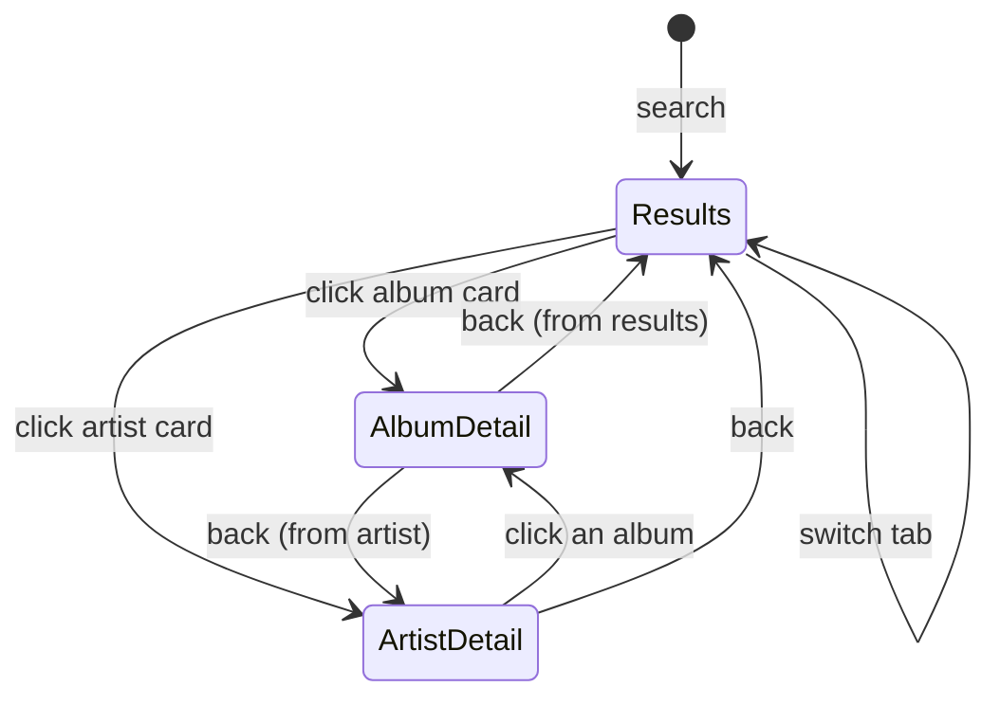

# feat: Unified tabbed search for the Subsonic Browse plugin

## Summary

Give the `subsonic-browse` plugin a single search box that returns Tracks, Albums, and Artists under tabs modeled on the library SearchView. Album cards drill into a track list (with a play button); artist cards drill into their albums; album tracks resolve and play on demand. The work extends the existing plugin (`src-tauri/plugins/subsonic-browse/index.js`) only — no core app change.

---

## Problem Frame

Today the plugin does flat **song** search: one query, one row list of tracks. Its `search3` call hard-zeros `artistCount` and `albumCount`, so it discards the album and artist results the same call already returns. A user who wants to find an album or artist across their registered servers can't, and the single list feels foreign next to the rest of the app, which trains users on the library SearchView's tabbed Tracks/Artists/Albums surface (see origin: `docs/brainstorms/2026-06-23-subsonic-unified-search-requirements.md`).

---

## Requirements

Traceable to the origin requirements doc. Plan honors origin R1–R11, with one narrowing noted below.

**Search & data**
- R1. One query searches all registered servers in parallel and returns tracks, albums, and artists from a single `search3` call per server. (origin R1)
- R2. Results render only after a search; before that the view shows a placeholder, mirroring SearchView's empty state. (origin R2)
- R10. Albums merge across servers by normalized (artist + title); artists by normalized name — reusing the existing dedup, "N servers" affordance, and healthy-server failover. (origin R10)

**Tabbed UI**
- R3. Three tabs — Tracks / Albums / Artists — each with a result count. No Tags tab. (origin R3)
- R4. Tracks render as a row list; Albums and Artists as image-card grids. Active tab and per-tab scroll position persist as the user switches tabs and enters/leaves detail. (origin R4)

**Card interaction**
- R5. Clicking a track plays it within the current result set's queue context (existing behavior preserved). (origin R5)
- R6. Clicking an album card body opens its detail; a play button on album cards plays the album immediately. **Narrowed from origin:** artist cards are **drill-in only** — no play button (see KTD2). (origin R6, narrowed)

**Detail sub-views**
- R7. Album detail shows the album's tracks (via `getAlbum`), per-track play, and a back affordance. (origin R7)
- R8. Artist detail shows the artist's albums as a card grid (via `getArtist`); each album there opens its album detail. (origin R8)
- R9. Detail sub-views render inside the plugin's single sidebar view by swapping content, not by registering new sidebar items. (origin R9)

**Integration**
- R11. Tracks from any tab or detail view carry the existing `xsonic://` scheme and flow through the current stream resolver, download provider, and scrobble-back unchanged. (origin R11)

---

## Key Technical Decisions

- KTD1. **Reuse the `play-playlist` card affordance — no core renderer change.** `card-grid` shows a play-button overlay only when an item's `contextMenuActions` includes `{ id: "play-playlist" }`, and the body click fires the item's own `action` (`src/components/pluginViews/pluginViews.tsx:135-159`). Album cards therefore carry `action: "open-album"` plus a `play-playlist` context action; the hybrid behavior is pure plugin data. The `...` overflow menu will also list "Play" (it is built from `contextMenuActions`) — an accepted cosmetic.
- KTD2. **Artist cards are drill-in only (no play button).** "Play all" for an artist would require fetching the artist's albums and then each album's tracks (N+1 `getAlbum` calls per click). Play stays at album granularity, where it is a single `getAlbum`. Artist cards omit `contextMenuActions`, so no play button renders.
- KTD3. **Single-view drill-in via content swap.** The plugin holds its view state in memory (`state.view`, a small nav back-stack) and re-renders the one `subsonic-browse` view through `setViewData`, distinct `scrollKey` per surface — the same `state.view` content-swap pattern `src-tauri/plugins/search-providers/index.js` uses (its `list`/`form` switch). No `navigateToView`, no extra sidebar items.
- KTD4. **Cross-server merge extends to albums and artists.** Reuse the existing `norm()` / `songKey()` normalization and `alternates[]` + `downServers` failover: albums keyed by `norm(artist)+norm(title)`, artists by `norm(name)`.
- KTD5. **Detail data and play tracks fetched lazily.** Search results never pre-fetch album tracks. `getAlbum` is called when an album is opened or played; `getArtist` when an artist is opened. Album play picks a healthy server from the album's alternates before fetching.
- KTD6. **Playback path is unchanged.** Resolved tracks keep the `xsonic://{serverId}/{trackId}` scheme and reuse `toPluginTrack` + `state.alternates` indexing, so the existing `onResolveStreamByUri("xsonic")`, download provider, and scrobble-back fire as-is.

---

## High-Level Technical Design

The plugin's single view becomes a small state machine over results plus two detail surfaces. A nav back-stack lets artist → album → back return to the artist, not to results.

Each transition is a `setViewData` re-render of the one `subsonic-browse` view with a surface-specific `scrollKey` (`q:<query>:<tab>` for results, `album:<id>` / `artist:<id>` for detail) so scroll position is restored per surface. "Back" pops the nav stack.

---

## Implementation Units

All units edit `src-tauri/plugins/subsonic-browse/index.js`. Plugins run as runtime ES5 with no unit-test harness in this repo (see Risks), so test scenarios are **behavioral**: run `npm run tauri dev`, add a Subsonic/Navidrome server in the plugin's Settings, and verify against a real or seeded library.

### U1. Multi-type search and cross-server merge

- **Goal:** `search3` returns and merges tracks, albums, and artists across all servers.
- **Requirements:** R1, R10.
- **Dependencies:** none.
- **Files:** `src-tauri/plugins/subsonic-browse/index.js`
- **Approach:** In the `search3.view` query (currently `…&songCount=…&artistCount=0&albumCount=0`), request non-zero `artistCount` and `albumCount` alongside `songCount`. Capture `searchResult3.album` and `searchResult3.artist`. Add `mapAlbum(server, a)` and `mapArtist(server, ar)` mirroring `mapSong` (id `serverId/entityId`, `coverId`, display fields). Extend `searchAll` to return three merged lists: songs (existing key), albums keyed by `norm(artist)+norm(title)`, artists keyed by `norm(name)`, each accumulating `alternates`. Preserve the per-server timeout and `downServers` tracking.
- **Patterns to follow:** existing `mapSong`, `searchServerSafe`, `searchAll`, `songKey`, `norm` in the same file.
- **Test scenarios:**
  - Happy path: a query that matches a known album and artist returns non-empty album and artist lists in addition to tracks.
  - Merge: the same album present on two servers collapses to one entry whose `alternates` length is 2.
  - Edge: a query matching only songs returns empty album/artist lists without error.
  - Failure: one server timing out still returns merged results from the others and marks the slow server down (unchanged behavior, re-verified for the new lists).

### U2. Tabbed results shell and tab state

- **Goal:** render the search box + Tracks/Albums/Artists tabs with counts and the active tab's body; placeholder before any search.
- **Requirements:** R2, R3, R4.
- **Dependencies:** U1.
- **Files:** `src-tauri/plugins/subsonic-browse/index.js`
- **Approach:** Add `state.activeTab` (default `"tracks"`). In `renderBrowse`, after a search, emit a `tabs` node (`{ id, label, count }` per list) above the body and render the active body: Tracks → existing `track-row-list`; Albums/Artists → `card-grid` (builders from U3). Before a search, render the placeholder text. While `state.searching` is true, render only the `search-input` + a `loading` node — no tabs until results arrive. A tab with zero results shows a short empty body (`No tracks found.` / `No albums found.` / `No artists found.`), not a blank panel. Register `onAction("switch-tab", d => { state.activeTab = d.tabId; renderBrowse(); })`. Fold the active tab into `scrollKey` (`q:<query>:<tab>`) so each tab restores its own scroll. Tabs auto-hoist above the scroll area (renderer behavior).
- **Patterns to follow:** `src/components/SearchView.tsx` tab + count + empty-state shape; existing `renderBrowse` and `search-input` usage.
- **Test scenarios:**
  - Happy path: after a search, three tabs show with correct counts; clicking a tab swaps the body without re-querying.
  - Edge: a tab with zero results shows a "no results" body, not a blank panel.
  - Scroll memory: scroll the Albums tab, switch to Tracks and back — Albums scroll position is restored.
  - Empty state: before searching, the placeholder shows and no tabs render.

### U3. Album and artist cards with hybrid interaction

- **Goal:** render albums and artists as card grids; album cards drill-in + play, artist cards drill-in only.
- **Requirements:** R4, R6 (narrowed per KTD2), R10.
- **Dependencies:** U1, U2.
- **Files:** `src-tauri/plugins/subsonic-browse/index.js`
- **Approach:** Hold U1's merged results in `state.songResults` / `state.albumResults` / `state.artistResults`, each entry carrying its own `alternates[]`. `cardFromAlbum(album)` → `CardGridItem` `{ id: "serverId/albumId", title, subtitle: artist + (" · N servers" when alternates>1), imageUrl: coverUrl(...), action: "open-album", contextMenuActions: [{ id: "play-playlist", label: "Play" }], targetKind: "album" }`. `cardFromArtist(artist)` → `{ id: "serverId/artistId", title: name, subtitle: alternates>1 ? "N servers" : undefined, imageUrl, action: "open-artist", targetKind: "artist" }` with **no** `contextMenuActions` (no play button, per KTD2). Register `onAction("open-album")` / `onAction("open-artist")` → U4 detail; `onAction("play-playlist")` → U5 album play. The card play button always fires the renderer-hardcoded literal `play-playlist`; resolve its `itemId` against `state.albumResults`, **not** `state.results` — the existing `play-song` handler hard-indexes the song list and would no-op on an album id.
- **Patterns to follow:** existing `rowFromSong`; the `card-grid` contract in `src/types/plugin.ts` (`CardGridItem`) and `src/components/pluginViews/pluginViews.tsx`.
- **Test scenarios:**
  - Happy path: Albums tab shows cards with cover, title, and "artist" subtitle; hovering an album card reveals a play button; artist cards reveal **no** play button.
  - Interaction: clicking an album card body opens album detail (U4); clicking its play button plays the album (U5) and stays on the results tabs.
  - Merge affordance: a 2-server album card's subtitle reads "… · 2 servers".
  - Edge: an album with no cover renders the card-grid placeholder art, not a broken image.

### U4. Detail sub-views and navigation state

- **Goal:** album detail (tracks via `getAlbum`), artist detail (albums via `getArtist`), with back navigation inside the one view.
- **Requirements:** R7, R8, R9.
- **Dependencies:** U3.
- **Files:** `src-tauri/plugins/subsonic-browse/index.js`
- **Approach:** Add `state.view` (`"results" | "album" | "artist"`) and a nav back-stack; the `search-input` node renders only on the results view, never in detail. Add `getAlbumTracks(server, albumId)` (`getAlbum.view&id=`) and `getArtistAlbums(server, artistId)` (`getArtist.view&id=`) via the existing `subsonicGet`; choose a healthy server from the entity's `alternates`. `renderAlbumDetail` → a `detail-header` node (DetailHero: `imageUrl`=cover, `title`=album, `subtitle`=artist, `playAction`, `backAction`) + `track-row-list` of the album's songs held in `state.detailTracks`, each row firing `play-album-track` (a distinct action — **not** `play-song`). `renderArtistDetail` → a `detail-header` node (`artShape: "circle"`, `backAction`) + `card-grid` of the artist's albums; those album cards keep the `open-album` body action **and** the `play-playlist` button, so album-granularity play works inside artist detail too (origin R6). Route all three surfaces through `setViewData` with surface-specific `scrollKey` (`q:<query>:<tab>`, `album:<id>`, `artist:<id>`); `back()` pops the nav stack and calls `renderBrowse()`, which reads the unchanged `state.activeTab` so the prior tab is restored. Show a `loading` node while a detail fetch is in flight. Known cosmetic: the renderer hardcodes the detail-header entity label to "album" (`src/components/PluginViewRenderer.tsx`), so the artist hero reads "album" — accept it, or fix the renderer as a prerequisite.
- **Patterns to follow:** in-repo single-view drill-in via `state.view` content swap — `src-tauri/plugins/search-providers/index.js` (its `list`/`form` switch); `PluginViewRenderer` scroll memory; `SearchView` detail layout for visual parity.
- **Test scenarios:**
  - Happy path: opening an album shows its tracks; opening an artist shows their albums.
  - Nav stack: artist → open an album → back returns to the artist detail; back again returns to results with the Artists tab still active.
  - Artist detail: an album card's play button inside artist detail plays that album.
  - Loading: a slow `getAlbum` shows the loading node, then the track list.
  - Failure: `getAlbum`/`getArtist` error shows a readable message and a working back affordance (no stuck spinner); error is `console.error`-logged.
  - Edge: an artist with zero albums shows an empty-state message, not a blank grid.

### U5. On-demand play resolution

- **Goal:** play albums and detail tracks via `xsonic://` without changing resolvers.
- **Requirements:** R5, R6 (album), R11.
- **Dependencies:** U1, U3, U4.
- **Files:** `src-tauri/plugins/subsonic-browse/index.js`
- **Approach:** `albumToPluginTracks(album)` → pick a healthy server from the album's `alternates`, fetch its `getAlbum` tracks, map each to a `PluginTrack` (`path: xsonic://server/trackId`, `image_url`) via the existing `toPluginTrack` shape, and index each track id into `state.alternates` so the stream resolver can fail over. `onAction("play-playlist")` resolves the album by `itemId` from `state.albumResults`, builds its tracks, stores them in `state.detailTracks`, and calls `api.playback.playTracks(tracks, 0, { name: album.title, coverUrl, source: "playlist" })`. `onAction("play-album-track")` plays from inside album detail: `playTracks(state.detailTracks, indexById(itemId), { name: album.title, … })`. The existing `onResolveStreamByUri("xsonic")`, download provider, and scrobble-back are untouched.
- **Patterns to follow:** existing `toPluginTrack`, the `api.playback.playTracks(...)` call in `play-song`, and the `state.alternates` indexing in `runSearch`.
- **Test scenarios:**
  - Happy path: pressing an album card's play button enqueues and starts the album's tracks with an album-named queue context banner.
  - Detail play: clicking a track inside album detail plays from that track with the rest of the album queued after it.
  - Integration: a played `xsonic://` track scrobbles back to its origin server (existing `track:scrobbled` hook) — re-verify it fires for album-sourced tracks.
  - Failover: when the album's primary server is down at play time, resolution picks another server from its alternates.

---

## Scope Boundaries

- No Tags / genre tab — `search3` returns none.
- No browse-without-search (no "list all albums", no alphabetical browse). The surface stays query-driven.
- Results never enter the library — this remains a live discovery layer, distinct from a `subsonic` collection.
- No per-tab view-mode toggle (table / list / tiles). Rendering is fixed: rows for tracks, card grids for albums/artists.
- No play button on artist cards (KTD2). Album-granularity play is still reachable from the artist's album grid inside artist detail.
- Artist detail surfaces the artist's albums only — loose songs from the search result are not shown (origin default, resolved at planning).

### Deferred to Follow-Up Work

- A generalized neutral "play" card affordance in the core renderer (instead of reusing `play-playlist`) — only if another plugin needs album/artist play buttons with cleaner semantics.
- Artist-level "play all", if later wanted — would need a `getArtist` → per-album `getAlbum` fan-out (or `getTopSongs` where servers support it).

---

## Risks & Dependencies

- **Latency:** album play and both detail views add a `getAlbum`/`getArtist` round-trip. Mitigate by choosing a healthy server first and showing the `loading` node; keep detail fetches lazy (KTD5).
- **Server capability:** assumes servers expose `getAlbum` and `getArtist` (standard Subsonic). The plugin already uses `search3`, `stream`, `download`, `scrobble`, and `getCoverArt`, so this is the same API surface.
- **Track-level failover within an album** is limited to the server that served `getAlbum`; album-level failover (picking a healthy server before the fetch) still applies.
- **No plugin unit-test harness:** plugin code is runtime ES5 not covered by vitest. Verification is manual/behavioral in `npm run tauri dev` against a Subsonic server, per the unit test scenarios. Every new `catch`/`.catch()` must `console.error` (project convention).

---

## Sources & Research

- Origin requirements: `docs/brainstorms/2026-06-23-subsonic-unified-search-requirements.md`
- Plugin being extended (search/play/resolvers, `search3` count-zeroing): `src-tauri/plugins/subsonic-browse/index.js`
- Card-grid play-vs-body-click contract: `src/components/pluginViews/pluginViews.tsx`; node-type definitions: `src/types/plugin.ts`
- Plugin view rendering + `scrollKey` scroll memory: `src/components/PluginViewRenderer.tsx`
- In-repo single-view drill-in precedent (`state.view` content swap): `src-tauri/plugins/search-providers/index.js`
- Library tabbed search to mirror (tabs, counts, empty state): `src/components/SearchView.tsx`
- A verified quote-sheet with `file:line` pointers was produced during brainstorming at `/tmp/compound-engineering/ce-brainstorm/subsonic-unified-search/grounding.md` (transient; the repo files above are authoritative).
