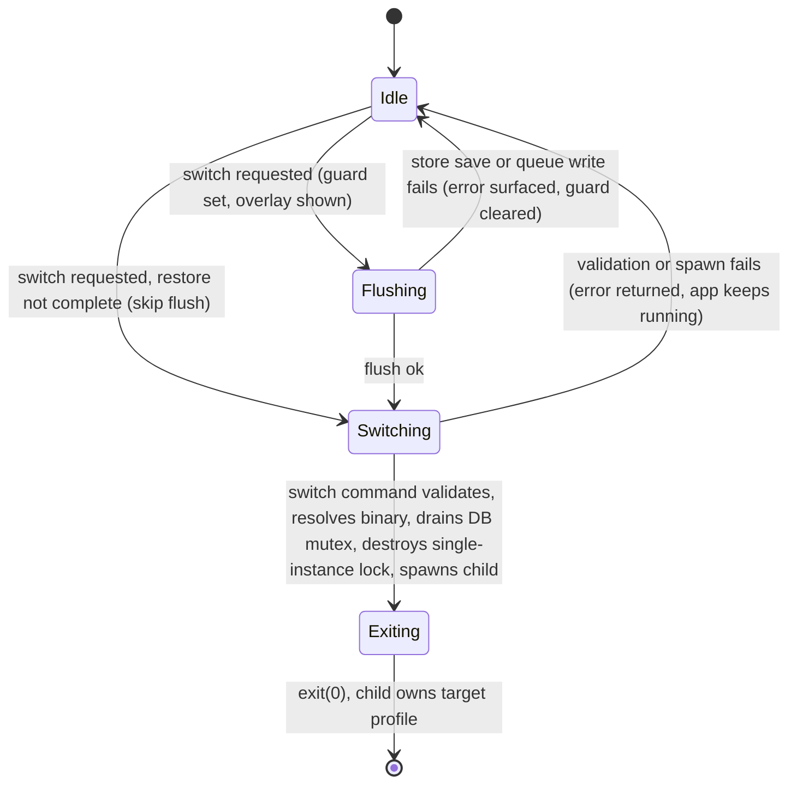
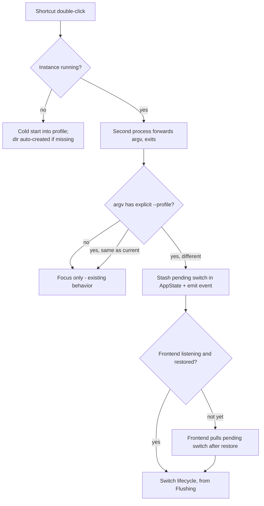

# feat: In-app profile manager with switching and shortcuts

## Summary

Grow the read-only profile rows in Settings → General into a Profiles manager: list existing profiles, switch into one (flush pending state, respawn the app with `--profile <name>`, exit), create-and-switch into new profiles, and generate per-profile desktop shortcuts. The single-instance callback becomes profile-aware so a profile shortcut opened while the app is running triggers the same switch flow.

---

## Problem Frame

Profiles isolate everything under `profiles/{name}/` but are launch-time only — the sole way into a non-default profile is a terminal command. Settings shows the current profile read-only; no command enumerates profiles, no relaunch mechanism exists, and neither debounced writer (app store, queue manifest) has a flush surface (see origin: docs/brainstorms/2026-07-05-profile-manager-requirements.md).

---

## Requirements

R1–R9 carry the origin document's numbering; R10–R13 are plan-discovered hardening requirements.

**Profile list**

- R1. Settings → General lists the subdirectories of `profiles/` that pass the profile-name rule, sorted, with the current profile marked. Non-directory entries (`.DS_Store`) and invalid-name directories are filtered out.

**Switching**

- R2. Selecting another profile relaunches the app into it — equivalent to restarting with `--profile <name>`.
- R3. Before the relaunch, both debounced writers are flushed: the app store (`LazyStore.save()`) and the queue manifest (immediate ref-based `main_playlist_write`). If either flush fails, the switch aborts with an error; the app keeps running.
- R4. The CLI arg and env var keep their current precedence; the respawn clears the inherited `VIBOPLR_PROFILE` so the new `--profile` arg wins.

**Creation**

- R5. Profiles are created by name, validated backend-side with the existing rule (1–64 chars, alphanumeric/hyphen/underscore, starts alphanumeric). Duplicate names (including case-collisions on case-insensitive filesystems) are rejected with a message shown in the still-open prompt.
- R6. After creation the app switches into the new profile (R2); onboarding runs there via the existing per-profile `onboardingComplete` gate — no new work.

**Shortcuts**

- R7. Each listed profile offers "Create shortcut": a double-clickable launcher on the Desktop opening the app into that profile — `.lnk` on Windows, wrapper `.app` bundle on macOS, `.desktop` file on Linux. Existing shortcuts are silently overwritten; success/failure surfaces via `addLog`.
- R8. Opening a shortcut from a cold start launches straight into that profile (existing startup path; the profile dir auto-creates if missing).
- R9. Opening a profile-B shortcut while running in profile A triggers the switch flow into B (release builds; single-instance is not registered in dev). Same-profile shortcut just focuses the window.

**Handoff and switch safety**

- R10. A second launch whose argv has **no** explicit `--profile` keeps today's focus-only behavior — it is never treated as "switch to default".
- R11. A switch request arriving before restore completes skips the flush entirely (nothing is dirty; flushing pre-restore would overwrite the saved queue with an empty one) and proceeds.
- R12. From switch-start to exit, the UI shows a blocking "Switching to <name>…" overlay and a single-flight guard ignores further switch requests.
- R13. The switch command validates the target and resolves the binary path **before** releasing the single-instance lock; spawn failure after that point returns an error and the app keeps running.

---

## Key Technical Decisions

- **`--profile` argv is the carrier; env var cleared on respawn.** The single-instance callback receives only the second process's argv (never its env), so argv is the only channel that reaches a running instance. Env resolution runs *before* argv in `run()`, and a spawned child inherits the parent env — so the respawn must `env_remove("VIBOPLR_PROFILE")` or the old profile silently wins.
- **Manual destroy → spawn → exit, not `relaunch()`.** `tauri::process::restart()` respawns with the original argv — no injection point. The switch command replicates it: resolve `tauri::process::current_binary(&env)` (AppImage-safe; never raw `current_exe()`), call `tauri_plugin_single_instance::destroy()` (cfg-gated, release only), spawn with `["--profile", name]`, then exit. Destroy precedes spawn (else the child forwards-and-exits against the still-live parent) but happens as late as possible (R13).
- **Flush is an explicit, reusable drain — not a new writer.** Store side: add a `save()` passthrough to the `AppStore` interface. Queue side: a `flushNow()` on `useQueue` that reads from the existing refs (`queueRef`/`queueIndexRef`/`queueModeRef`) and fires the same `main_playlist_write` payload via the pure `buildManifest`/`buildState`. No-op while `restoredRef.current` is false. Built as a standalone function so a future flush-on-window-close fix can reuse it (deferred, see Scope Boundaries).
- **Handoff mirrors the deep-link pattern, plus a pull path.** The callback parses `--profile` from forwarded argv (both `--profile name` and `--profile=name`), stashes it as a pending switch in `AppState`, and emits an event. The frontend handles the live event *and* pulls the pending value once after restore — the event can fire before any listener exists (same reason the deep-link path has a startup catch-up).
- **Windows `.lnk` via the `mslnk` crate, target-gated.** Pure-Rust, purpose-built, added under `[target.'cfg(windows)'.dependencies]` so non-Windows builds are unaffected. The zero-dependency alternative (shelling `powershell -Command` + WScript.Shell) was rejected: slower, execution-policy/AV-flag exposure. (Chose the smaller reliability risk over zero-dep purity.)
- **macOS shortcut = generated wrapper `.app` bundle.** Aliases can't carry args; `.command` files flash a Terminal window. The bundle contains an `Info.plist` with a distinct per-profile `CFBundleIdentifier` and an executable launcher script that runs `open -nb <app-identifier> --args --profile <name>` — `-n` forces a real second process (Launch Services otherwise activates the running app and drops `--args`), which then routes through single-instance and exits.
- **Backend-only name validation.** Rust's `is_alphanumeric()` accepts Unicode letters (e.g. Greek), so a JS `[a-zA-Z0-9]` mirror would wrongly reject names the backend accepts. The extracted `validate_profile_name` is the single source; the UI surfaces its error message.
- **`create_dir`, not `create_dir_all`.** `AlreadyExists` gives duplicate detection for free — including case-collisions on macOS/Windows, where `create_dir_all("Work")` over existing `work/` would silently merge.
- **Deleted-profile asymmetry is deliberate.** A shortcut to a manually deleted profile recreates it empty (cold-start parity — startup auto-creates the dir); the Settings switch path validates existence, errors, and refreshes the list (stale-list race).
- **No confirmation on switch.** Switching is an explicit user action and the flush makes it lossless; playback stopping is the documented consequence (resolves the origin's open question).

---

## High-Level Technical Design

Switch lifecycle (both entry points — Settings click and shortcut handoff — converge here):

Second-launch handoff (release builds only):

---

## Implementation Units

### U1. Profile commands foundation: validate, list, create

- **Goal:** Backend surface for the profile list and creation.
- **Requirements:** R1, R5. Advances origin F2 (create flow: validate → create dir).
- **Dependencies:** none.
- **Files:** `src-tauri/src/lib.rs` (extract validation, register commands), `src-tauri/src/commands/app.rs` (new commands + tests).
- **Approach:** Extract the inline name check at `lib.rs:501-508` into `validate_profile_name(name) -> Result<(), String>`; the startup path keeps its exit-on-error behavior, the commands return `Err`. `list_profiles` reads `app_dir.parent()` (the `profiles/` dir), filters to directories whose names pass validation, sorts, and returns names plus the current profile name. Current-profile marking compares case-insensitively (a `--profile Work` launch against an existing `work/` dir must still mark one row current). `create_profile` validates then `create_dir`, mapping `AlreadyExists` to a duplicate-name error. Register both in the `invoke_handler!` macro list.
- **Patterns to follow:** command shape in `src-tauri/src/commands/app.rs` (`State<'_, AppState>`, `Result<T, String>`); test helpers in `src-tauri/src/commands/mod.rs` (`test_state()`), `tempfile` for filesystem tests.
- **Test scenarios:**
  - Validation: accepts `work`, `kids-2`, `a`, Unicode-letter names, 64-char name; rejects empty, 65-char, leading `-`, names with spaces or `|`.
  - Covers AE2 (setup step). Create `kids` succeeds and the dir exists; creating `kids` again errors "already exists"; creating `KIDS` when `kids` exists errors on a case-insensitive tmpdir (assert via `create_dir` behavior).
  - List: tmpdir with valid dirs, an invalid-name dir (`My Profile`), and a stray file returns only the valid dirs, sorted; current profile is marked, including when casing differs.
- **Verification:** `cargo test` green; `list_profiles`/`create_profile` invocable from devtools.

### U2. Switch command and profile-aware single-instance

- **Goal:** The relaunch mechanism and the running-instance handoff.
- **Requirements:** R2, R4, R9, R10, R13. Backend half of origin F1 (switch) and F3 (launch via shortcut, warm path).
- **Dependencies:** U1 (validation).
- **Files:** `src-tauri/src/commands/app.rs` (switch + pending-switch commands, argv-parse helper + tests), `src-tauri/src/lib.rs` (single-instance callback, AppState field), `src-tauri/src/commands/mod.rs` (AppState).
- **Approach:** `switch_profile(name)`: reject the current profile and invalid/missing targets; resolve `current_binary(&app.env())`; lock-and-drop the DB mutex once (drains any in-flight write — the real carrier of AE1's like, since likes are immediate invokes, not debounced); `#[cfg(not(debug_assertions))]` `single_instance::destroy()`; spawn with `["--profile", name]` and `env_remove("VIBOPLR_PROFILE")`; `app.exit(0)`. Any failure before spawn returns `Err` and the app keeps running (post-destroy failure additionally logs that single-instance protection is gone for this session). Extend the single-instance callback: parse `--profile` from forwarded argv with a pure helper (both arg forms); absent or same-as-current → focus only; different → store in a new `AppState` pending-switch slot and emit a switch-request event. Add a command the frontend calls once after restore to consume the pending value.
- **Technical design (directional):** order inside `switch_profile` — validate → resolve binary → DB barrier → destroy → spawn → exit; nothing destructive before the last possible moment.
- **Patterns to follow:** deep-link forwarding in the existing callback (`lib.rs:560-578`) and its frontend catch-up (`src/App.tsx` deep-link pull after listener registration).
- **Test scenarios:**
  - Argv parse helper: `["app", "--profile", "b"]` → `b`; `["app", "--profile=b"]` → `b`; no flag → none; flag with no value → none; `--profile` equal to current → treated as same (Covers R10 via the none-case).
  - `switch_profile` with the current profile name errors; with an unknown profile errors; with an invalid name errors.
  - Handoff behavior (release-only) is covered by the release verification below, not unit tests.
- **Verification:** `cargo test` green; `cargo check --release` (the cfg-gated destroy + callback compile); release-build manual check: second launch with `--profile other` triggers the frontend event; plain second launch only focuses.

### U3. Flush machinery

- **Goal:** A reusable drain for both debounced writers.
- **Requirements:** R3, R11. The flush step of origin F1.
- **Dependencies:** none (parallel with U1/U2).
- **Files:** `src/store.ts` (save passthrough on the `AppStore` interface), `src/hooks/useQueue.ts` (`flushNow()`), `src/__tests__/mainPlaylist.test.ts` (payload-equivalence tests).
- **Approach:** `AppStore.save()` delegates to `LazyStore.save()`. `useQueue` exposes `flushNow()`: returns early (resolved no-op) while `restoredRef.current` is false; otherwise invokes `main_playlist_write` with `buildManifest(queueRef.current, playlistContextRef.current)` + `buildState(queueIndexRef.current, queueModeRef.current)` — same payload as the debounced effect, read from refs per the queue ref rule. A `playlistContextRef` mirror must be added alongside the three existing refs (it does not exist today; only `queueRef`/`queueIndexRef`/`queueModeRef` do). Failures reject so the caller can abort the switch. A late duplicate from the still-armed debounce timer is harmless (identical payload, atomic write).
- **Test scenarios:**
  - Covers AE1 (partially — the store/queue half; the in-flight-invoke half lives in U2's DB barrier). Flush payload equals the debounced payload for the same state (pure `buildManifest`/`buildState` equivalence, extending `src/__tests__/mainPlaylist.test.ts`).
  - `flushNow` before restore resolves without invoking (assert via injected invoke mock in a pure-logic extraction).
  - `flushNow` rejection propagates (not swallowed).
- **Verification:** `npm test` green; no new writer competes with the debounced effect (grep: `main_playlist_write` call sites remain the effect + flush only).

### U4. Switch orchestration and handoff handling

- **Goal:** The frontend flow both entry points converge on.
- **Requirements:** R2, R3, R9, R11, R12. Frontend half of origin F1 and F3.
- **Dependencies:** U2, U3.
- **Files:** new `src/hooks/useProfileSwitch.ts` (orchestration), `src/App.tsx` (event subscription, pending pull, overlay render), new `src/components/ProfileSwitchOverlay.tsx` (the blocking switch overlay), new `src/__tests__/profileSwitch.test.ts` (pure decision helpers).
- **Approach:** `switchToProfile(name)`: single-flight guard ref → show overlay → flush (store save + queue `flushNow`; skipped entirely when restore hasn't completed, per R11) → on flush failure: `console.error`, error surface (`addLog` + overlay dismissed, guard cleared) → `invoke("switch_profile")` → on `Err`: same error path. Subscribe to the switch-request event; after restore completes, pull the pending switch once (mirrors the deep-link catch-up). Overlay is a full-screen blocking layer ("Switching to <name>…", `ds-spinner`), skin-token colors only.
- **Test scenarios:**
  - Covers AE3. Pure decision helper: (restored, switching-in-flight, flush-ok) → action matrix — not-restored → switch-without-flush; in-flight → ignore; flush-fail → abort.
  - Event payload for the current profile → ignored (defensive; backend already filters).
- **Verification:** `npm test` + `npx tsc --noEmit` green; dev-build manual check: Settings switch relaunches into the target profile and the queue/likes survive round-trip (AE1 end-to-end).

### U5. Shortcut creation command

- **Goal:** Per-platform "Create shortcut" backend.
- **Requirements:** R7, R8. Enables origin F3 (cold path).
- **Dependencies:** U1 (validation).
- **Files:** new `src-tauri/src/profile_shortcuts.rs` (content builders + inline `#[cfg(test)]` tests + module registration in `lib.rs`), `src-tauri/src/commands/app.rs` (command), `src-tauri/Cargo.toml` (windows-gated `mslnk`).
- **Approach:** `create_profile_shortcut(name)` validates, resolves the Desktop via Tauri's path resolver, and writes the platform artifact, silently overwriting:
  - **Windows:** `mslnk` ShellLink → `current_binary`, arguments `--profile <name>`, icon = the exe.
  - **macOS:** wrapper bundle `Viboplr – <name>.app`: `Info.plist` (distinct `CFBundleIdentifier` derived from the app identifier + profile, icon copied from the app bundle when readable), `Contents/MacOS/launcher` script `exec open -nb <app-identifier> --args --profile <name>`, `chmod +x`.
  - **Linux:** `viboplr-<name>.desktop` with `Exec` pointing at the AppImage path when `env.appimage` is set, else `current_binary`; `Terminal=false`; exec bit set. GNOME may still require right-click → Allow Launching (note in the success `addLog`).
  - Content generation (plist, launcher script, desktop entry) as pure string-building functions for tests. Names need no quoting gymnastics — the charset excludes spaces and shell metacharacters.
- **Test scenarios:**
  - Desktop-entry/plist/script builders: expected content for a given name, binary path, identifier; AppImage path preferred when set.
  - Command writes the artifact into a tempdir-overridden target and overwrites an existing one without error (platform-current variant only).
  - Test expectation for cross-platform variants not runnable on the dev machine: none — cfg-gated; covered by content-builder tests plus `cargo check --release`.
- **Verification:** macOS (dev machine): generated `.app` double-click cold-starts into the profile; with the app running, it triggers the handoff (release build).

### U6. Settings Profiles UI

- **Goal:** The user-facing manager in Settings → General.
- **Requirements:** R1, R5, R6, R7, R12 (entry point). UI entry for origin F1 and F2.
- **Dependencies:** U1, U4, U5.
- **Files:** `src/components/SettingsPanel.tsx` (Profiles group), `src/components/PromptModal.tsx` (error surface), `src/components/SettingsPanel.css` (only if needed).
- **Approach:** Replace the read-only Profile group with a Profiles list following the Dependencies-section shape: one `settings-row` per profile (name, current badge; the current row keeps the path + Copy/Open actions), right-aligned `ds-btn ds-btn--sm` actions — Switch (hidden/disabled on current), Create shortcut — and a group-title-row "New profile…" button opening `PromptModal`. Extend `PromptModal` with an optional error message + stay-open-on-error so backend rejections (invalid, duplicate) display inline; create success routes into `switchToProfile`. Buttons disable while a switch or create is in flight; `addLog` on shortcut success (with path) and on failures. Fix-as-you-go: replace the existing inline styles in the old Profile rows with the settings classes they duplicate.
- **Patterns to follow:** `DependenciesSection` in `src/components/SettingsPanel.tsx:678-885` (list rows, right-aligned action cluster, inline confirm block); modal-dismiss and `.ds-*` conventions.
- **Test scenarios:**
  - Covers AE2 end-to-end (manual): create `kids` → relaunch → empty library + onboarding wizard.
  - Covers AE4 (manual): quit from `work`, plain launch opens `default`.
  - Component logic stays thin; any extracted pure helper (e.g. list-row view model: mark-current, sort) gets a unit test per the pure-helper convention.
- **Verification:** `npx tsc --noEmit` + `npm test` green; visual check across two skins (skin-token compliance); all three view paths (list, create, shortcut) emit feedback per the conventions.

---

## Acceptance Examples

Carried from origin with one correction: origin AE1 attributed the like-loss risk to the 500ms debounce, but likes persist via an immediate invoke — the debounced state is the app store and queue manifest. AE1's protection is therefore split: the DB-mutex barrier (U2) covers in-flight like writes; the flush (U3) covers store/queue state.

- AE1. **Covers R3.** Given a track was liked moments before switching, when the user switches profiles, then the like and the current queue state are present when they return to that profile.
- AE2. **Covers R5, R6.** Given the user creates profile `kids`, when the app relaunches, then it runs as `kids` with an empty library and the onboarding wizard showing.
- AE3. **Covers R9, R12.** Given the app runs in `default`, when the user opens the `work` shortcut, then the app flushes, relaunches as `work`, and no second instance remains.
- AE4. **Covers session-only switching.** Given the user last used `work` and quit, when they launch with no args, then the app opens `default`.

---

## Scope Boundaries

Out of scope (per origin): rename/delete/duplicate profiles; profile identity (avatars, colors, caption-bar chip); remember-last-profile or launch pickers; cross-profile data sharing; running two profiles simultaneously.

### Deferred to Follow-Up Work

- Flush-on-normal-window-close: today's hard exit (`CloseRequested` → `std::process::exit(0)`) can lose ≤500ms of debounced state — pre-existing, and U3's reusable flush is the building block for fixing it.
- Per-profile Windows taskbar identity (AppUserModelID + badged icons, the full Chrome treatment).
- Filtering `dev-*` profiles from the release-build list, if they ever bother anyone.

---

## Risks & Dependencies

- **`mslnk` staleness:** last released 2022; the `.lnk` format is static, but Windows 11 Smart App Control behavior with generated links is unverified. Mitigation: shortcut failure is non-fatal (addLog error); PowerShell fallback remains possible later.
- **Single-instance is release-only:** the R9/R10 handoff cannot be exercised in `npm run tauri dev`. Mitigation: pure argv-parse tests + `cargo check --release` in CI habits + a release-build manual pass before release.
- **Env leak limitations (documented, not bugs):** a globally exported `VIBOPLR_PROFILE` overrides cold-start shortcuts (env precedes argv at startup); a second instance launched with only the env var forwards argv the callback can't act on → focus only.
- **Post-destroy spawn failure** leaves the session without single-instance protection (cannot re-init the plugin). Mitigated by R13 ordering; residual window is spawn-failure only, which is logged.
- **GNOME desktop trust:** `.desktop` files on the Desktop need Allow Launching regardless of exec bit; surfaced in the success message.

---

## Sources & Research

- Origin: docs/brainstorms/2026-07-05-profile-manager-requirements.md.
- Profile resolution + validation: `src-tauri/src/lib.rs:459-511`; profile dir + shared bin: `lib.rs:605-613`; single-instance callback: `lib.rs:560-578`; hard exit on close: `lib.rs:1067-1075`.
- Existing profile commands: `src-tauri/src/commands/app.rs:6-12,40-42`; AppState (`profile_name`, `app_dir`): `src-tauri/src/commands/mod.rs:92-95`; command registry macro: `lib.rs:43-45`.
- Store: `src/store.ts:65-105` (interface lacks save; `LazyStore` has it). Queue writer + refs: `src/hooks/useQueue.ts:62-81`; pure builders: `src/mainPlaylist.ts` (tested in `src/__tests__/mainPlaylist.test.ts`).
- UI patterns: Dependencies section `src/components/SettingsPanel.tsx:678-885`; existing Profile rows `:1239-1259`; `src/components/PromptModal.tsx`, `src/components/ConfirmModal.tsx`.
- Relaunch precedent (same-argv only): `src/hooks/useAppUpdater.ts:89`; `tauri-plugin-process` registered at `lib.rs:584`.
- Tauri externals: `tauri::process::restart` source (no argv injection; `current_binary` is AppImage/TOCTOU-safe); single-instance destroy-before-restart fix tauri PR #12313 (2.4.0) and open macOS restart issue tauri #13923 — both motivate the manual destroy→spawn→exit pattern; single-instance source: callback receives `(argv, cwd)` only, Windows transport is `|`-delimited (name charset excludes `|`); macOS `open -n` semantics (Launch Services drops `--args` without `-n`); freedesktop Desktop Entry spec; `mslnk` crate (crates.io).
