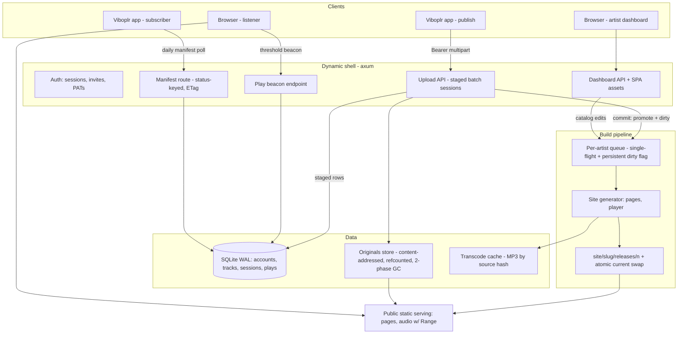
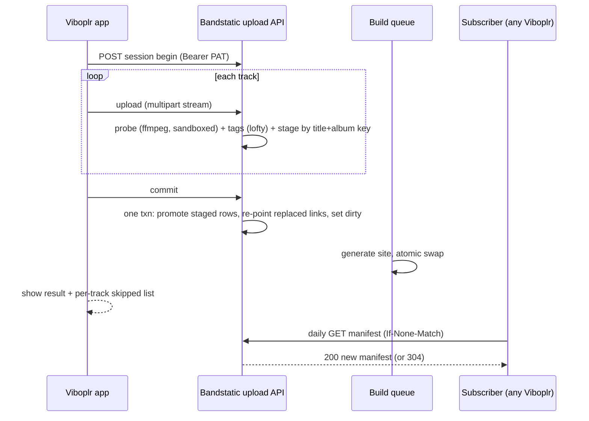

# feat: Bandstatic — self-hostable music distribution server

**Target repos:** most units target the new `outcast1000/bandstatic` repository (greenfield; paths are relative to its root). Units U11–U12 target this repository (`outcast1000/viboplr`). Each unit states its repo.

## Summary

Build Bandstatic: a single-binary Rust server an artist, label, or collective self-hosts to distribute music. Invited artists upload via a web dashboard or push directly from Viboplr; the server regenerates each artist's static public site (pages, web player, `manifest.json`) on every catalog change; listeners stream in the browser or one-click-subscribe in Viboplr; artists get anonymous play analytics and can export their whole site and leave. A small change in the Viboplr app adds the "publish to my server" target.

---

## Problem Frame

Viboplr's static publish bundle can't count plays and requires manual hosting; Faircamp has the same static ceiling, Funkwhale needs a sysadmin. Bandstatic fills the middle: Navidrome-easy to run, focused on distribution, with analytics — and every existing Viboplr install can subscribe with zero app changes because the manifest schema is already shipped (see origin: docs/brainstorms/2026-07-10-self-hosted-music-server-requirements.md).

The binding constraint discovered in flow analysis: **shipped clients treat URLs as identity** — for tracks (`ingest_manifest` upserts on `url` and prunes absences), catalogs, and publishers. A 200 with fewer tracks prunes; a non-2xx never prunes (stale rows persist and error daily). Every server-side decision about slugs, renames, removal, and storage layout is a decision about what existing installs do at their next daily poll, and none of it can be fixed client-side.

---

## Requirements

Origin requirements R1–R12 (see origin doc) are carried in full: web upload (R1), publish-from-Viboplr (R2), auto-regeneration (R3), public page + player (R4), compatible manifest + deep link (R5), invite-only accounts (R6), admin moderation (R7), authenticated dashboard / unauthenticated public surface (R8), anonymous play counts (R9, narrowed below), analytics dashboard (R10), export-and-leave (R11), single-binary minutes-to-running deploy (R12).

One narrowing: R9's "app/subscriber streaming via audio-serving logs" is **not implemented in v1** — log-based counting can't distinguish Viboplr's gapless prefetch (20–45 s ahead, `src/playback/progressMachine.ts` in the app repo) from real plays. v1 counts web-player beacons only; app-reported plays are deferred (see Scope Boundaries).

Plan-added requirements from flow analysis and design review:

**Identity and URL stability**

- R13. Artist slugs are immutable after account creation and tombstoned forever after removal — never reassigned, by anyone. Rename changes display name only (flows to clients via the manifest `name` field).
- R14. Removing an artist serves an empty manifest (HTTP 200) immediately — and the manifest stays empty-200 **indefinitely**, including after tombstoning (shipped clients never prune on non-2xx; a manifest 410 would strand any subscriber who missed the grace window with daily errors forever). Audio keeps serving through the 30-day grace window so already-synced clients don't break before their next poll; pages and audio return 410 after tombstoning.
- R15. Each track has a stable public URL independent of its audio bytes; replacing a track's audio keeps its URL. The manifest always emits `format` (URLs may lack extensions).
- R16. Track identity for upsert: per-artist normalized title+album key; identical content hash is rejected as a duplicate; same key with different audio replaces the track in place. `public_slug` is immutable for the life of the track across both audio replacement and metadata edits; the identity key recomputes on metadata edit.

**Publishing**

- R17. Uploads from the app run as a batch session — begin, upload N tracks, commit — producing one rebuild per push and a per-track skipped list on partial failure (mirroring the existing exporter's `skipped` reporting). Sessions are staged: nothing an uncommitted session uploaded is ever publicly visible, even across crashes and unrelated rebuilds.
- R18. Ingest validates that ffmpeg can decode the file (probe), not just that tags parse; tag-less files derive title from filename.

**Accounts and operations**

- R19. Admin credentials are bootstrapped out-of-band via CLI before the dashboard serves — no first-visitor setup page.
- R20. Invites are single-use, expiring (days-scale), and admin-revocable; the same mechanism issues password-reset links (no SMTP dependency).
- R21. Export prompts for the new base URL, rewrites all manifest/track URLs to it, and strips the play beacon (origin R11: counting stops after leaving).

**Security and resource safety**

- R22. Every filesystem path component on the public surface (artist slug, track slug, archive entry names) is server-generated from an allowlisted charset — artist-controlled strings never become path components, symlink targets, or unescaped page content.
- R23. The instance survives abuse without operator intervention: per-artist storage quota, instance free-space guard, login throttling before password verification, capped concurrent media processing, and bounded beacon state.

---

## Key Technical Decisions

**Contract and compatibility**

- **Manifest schema is pinned to the shipped Viboplr parser** (`src-tauri/src/manifest_sync.rs` in the app repo: top-level `name?`/`artist?`/`image?`/`tracks[]`; per-track `title`+`url` mandatory, optional `album`/`artist`/`duration_secs` (alias `duration`)/`track_number` (alias `track`)/`format`/`year`/`tags`/`cover`). Unknown fields are ignored, so Bandstatic may add fields but never renames or retypes these. Enforced by fixture contract tests in both repos, modeled on the app's ignored live test (`manifest_sync.rs` network test).
- **Manifest freshness via content-hash ETag + Last-Modified.** Clients already send `If-None-Match`/`If-Modified-Since` and skip all work on 304; an mtime-based ETag would bust every subscriber's cache on byte-identical rebuilds.
- **Manifests are a serve-layer dynamic response keyed on artist status**, not a build artifact: active = current catalog manifest; removed/tombstoned = empty-200 forever. This keeps removal semantics out of the build pipeline entirely.

**Architecture**

- **Static core, dynamic shell** (origin decision). Public catalogs are generated static sites; the running server is auth + upload + beacon + dashboard. Public attack surface stays near-inert.
- **Per-artist release trees.** Each artist builds into `site/<slug>/releases/<n>/` with their own `current` symlink — the per-artist single-flight queue is then the true serialization domain. (A single global release tree with per-artist queues is a lost-update bug: concurrent artist builds would silently revert each other.)
- **Single-flight build queue per artist with a persistent dirty flag** — a DB column written inside the commit transaction, cleared only on successful swap, scanned at startup so a crash after commit still rebuilds. Changes during a build re-mark dirty and trigger one follow-up. Workers re-validate artist status immediately before the swap.
- **Complete-releases invariant.** Builds write into a temp dir and rename the whole directory to `releases/<n>` only when complete — any `releases/<n>` that exists is complete; startup reaps temp debris. Publish flips a temp symlink over `current` via `rename` (`ln -sfn` is not atomic). Retention pruning never touches the target of `current` nor any release younger than a minutes-scale floor (sized to exceed the longest export or in-flight request), and retains 2–3 releases for rollback.
- **Stack: Rust, axum 0.8, rusqlite (SQLite), tower-http, tokio.** Matches the shop stack and the app's own axum precedent (`src-tauri/src/transcode_server.rs`).

**Data integrity and concurrency**

- **SQLite pins on every connection** (including the session store's): `journal_mode=WAL`, `synchronous=NORMAL`, seconds-scale `busy_timeout`, `foreign_keys=ON`. One writer connection behind a mutex, accessed from async handlers via `spawn_blocking`; the lock is never held across ffmpeg, build, or file I/O (workers snapshot the catalog in one short read, then release).
- **Files before rows.** Blobs materialize (temp → fsync → rename) before any DB write references them — every crash window errs on the orphan-file side, never on rows pointing at missing files. All refcount changes commit in the same transaction as the track-row mutation they mirror, and refcounts are recomputable (invariant: refcount = referencing live rows + staged session rows).
- **Reconciliation is designed in, not hoped for:** an orphan sweep at startup and periodically (zero-ref/unreferenced files past a grace age → deleted; rows referencing missing files → flagged as integrity errors, excluded from builds, surfaced in the admin dashboard — never silently dropped), plus a `bandstatic check` CLI subcommand that recomputes refcounts, verifies blob/transcode completeness, and repairs. Backup docs mandate running it after any restore (Litestream DB and restic file snapshots are independently timed).
- **Two-phase GC.** Refcount zero marks `deleted_at`; unlink happens only after a grace delay, inside a transaction that re-checks the mark and refcount (an identical concurrent upload resurrects the blob by clearing the mark in its own transaction). GC never deletes a hash still targeted by a public track path.

**Storage and media**

- **Originals are sacred.** Uploaded files stored verbatim in a content-addressed store with refcounts (two artists uploading the same file share a blob; deletion decrements, GC removes per the two-phase rule). Originals power downloads and export.
- **Path provenance is the load-bearing security constraint** (R22): artist slugs and track slugs are server-generated, `[a-z0-9-]` only, length-capped, reserved-name-guarded, collision-resolved by deterministic suffix at creation (checked against live *and tombstoned* slugs). Symlink targets are hash-only (`originals/<validated hex>`), never artist-derived; the generator verifies each resolved target stays inside the data dir. Alternative considered — a dynamic audio handler (slug→hash lookup) instead of symlinks — rejected for v1 because symlinks keep Caddy-direct serving and copy-tree export trivial; the constraint set above closes the symlink risks.
- **Web player streams ffmpeg-transcoded MP3** (~192 kbps) — universal browser support; FLAC is unreliable on iOS and Opus-in-MP4 doesn't play in Safari's audio element. Transcodes are content-addressed cache artifacts keyed by source hash, written temp+fsync+rename so cache presence implies completeness (a truncated artifact would otherwise be served forever). ffmpeg is a documented runtime dependency (the Faircamp/Navidrome precedent). Opus second `<source>` deferred.
- **ffmpeg is treated as an untrusted-media parser:** every invocation runs with a wall-clock timeout (kill on expiry), `-nostdin`, and a protocol allowlist (`file,crypto` — no http/concat/data/pipe, so crafted files cannot trigger SSRF or local file reads); concurrent ffmpeg processes are capped (ingest probes bounded separately from build transcodes).
- **Stable public track paths are slug-named links into the content store** — URL = track identity for subscribers; on audio replacement the link is re-pointed atomically **at ingest commit time** (temp-symlink + rename), not at the next build, so the public URL never dangles. Audio lives outside the swapped release dirs (never copied per release; open FDs keep streaming across a swap).
- **Public pages offer per-track download of the original** — essentially free, and the files are fetchable regardless.
- **Public HTML is auto-escaped by the template engine** (engine choice deferred, autoescape non-negotiable); artist strings enter inline JSON islands only through a serializer that escapes `<`, `>`, `&`, U+2028/9. Public responses carry `X-Content-Type-Options: nosniff` and a Content-Security-Policy; artist-supplied covers are never served as `image/svg+xml`.

**Auth**

- **Single-origin, path-based topology** (`https://host/<artist-slug>/`, dashboard under `/dashboard`): a security decision, not a style one — subdomain layouts are *same-site*, which would let public-page XSS defeat SameSite CSRF protection on the dashboard. Subdomains/custom domains are deferred and require revisiting the CSRF design.
- **argon2id at OWASP parameters (m=19 MiB, t=2, p=1)** for passwords; **cookie sessions** (`HttpOnly`, `Secure`, `SameSite=Lax`) via tower-sessions with SQLite store + axum-login (`session_auth_hash` tied to password hash so password change or reset invalidates sessions). Session id regenerates on login (fixation). No JWT, no OAuth.
- **CSRF beyond SameSite:** every dashboard/admin mutation is non-GET and requires a custom request header that cross-site forms cannot set; no state-changing GET exists.
- **Login is throttled before argon2 runs** (per-IP + per-account backoff, plus a global cap on concurrent verifications) — at 19 MiB per verify, an unthrottled login flood is a memory-exhaustion attack, not just brute force.
- **Invites and reset links: CSPRNG tokens, stored hashed, single-use enforced atomically (consume-on-claim in one UPDATE), ~7-day expiry, admin-revocable.** Lookup is by hash of the presented secret (fast hash — argon2 is for passwords, not high-entropy tokens). Claim/reset pages set `Referrer-Policy: no-referrer`, load no third-party assets, and redirect to a tokenless URL on success.
- **API tokens: per-artist PATs**, `bst_` prefix, 32+ random bytes, stored hashed, shown once, sent as `Authorization: Bearer` on the upload API. **Scope: upload/replace only** — destructive operations (delete track, remove account, token management) require an interactive session, bounding a leaked token's blast radius.

**Analytics**

- **Client beacon, never log parsing** (Navidrome/Funkwhale precedent: plays are explicit client submissions). Player JS fires once per track per page-load when the Last.fm rule is met (50% of duration or 4 minutes, whichever first; tracks under 30 s never count) via `sendBeacon`.
- **Beacon endpoint is defended:** the track id must exist and belong to a published artist (no rows for invented ids); strict small payload schema; per-track daily increment ceiling; UA bot blocklist; per-IP rate limit. CORS: the beacon accepts cross-origin no-credentials POSTs; the dashboard API is same-origin only.
- **Anonymous by construction:** replay dedupe (same page-load / ~30 min window) lives in a bounded in-memory TTL map — **never persisted** (a stored IP+UA hash would be retained personal data and would undercut the no-tracking claim; a restart resetting the window is a bounded, acceptable overcount). Only per-track daily aggregates are stored, incremented via a single conflict-target UPSERT. No cookies anywhere on the public surface.
- **Counts are best-effort and spoofable** — a design assumption: no security or economic feature may ever depend on them (guards the deferred payments/discovery ideas).
- **Trusted-proxy real-IP config from day one** — behind Caddy every listener is 127.0.0.1 otherwise, collapsing all dedupe and rate limiting.

**Deployment (the Navidrome story)**

- **Single binary, embedded dashboard assets** (`include_dir`), one data dir (`db` + `originals/` + `cache/` + `site/`), CLI `bandstatic init` bootstraps the admin, `bandstatic serve` runs, `bandstatic check` verifies/repairs store integrity. Config = file + env override + flags.
- **TLS via documented reverse proxy** (2-line Caddyfile shipped in docs); built-in ACME deferred. Backup documented as a pair: Litestream (DB) + restic/rclone (originals + site) — Litestream alone silently misses the audio — with restore ordering and a mandatory post-restore `bandstatic check`.

**Viboplr integration**

- **Extract the Track→`PublishTrack` resolution** (currently inline in `src-tauri/src/commands/collections.rs` `export_music_source`) into a shared helper; the new push command reuses it — no second resolution path.
- **Server credentials in the DB layer** (the collections-credentials precedent), never `app-state.json`. Upload via reqwest with the `multipart` feature enabled (feature add, not a new crate), progress/cancel mirroring `downloader.rs` (thread + `AtomicBool` + emitted events).
- **Dashboard is an embedded React SPA; public pages are server-generated static HTML** with a small hand-written player JS — no framework on the public surface.

---

## High-Level Technical Design

Component and data flow:



Publish-from-Viboplr sequence:



Artist lifecycle (manifest behavior is subscriber-visible and unpatchable client-side):

```mermaid
stateDiagram-v2
  [*] --> Invited: admin creates invite
  Invited --> Active: claim (single-use, expiring)
  Invited --> Revoked: admin revokes / expiry
  Active --> Active: rename = display name only, slug immutable
  Active --> Removed: admin removes artist
  Removed --> Tombstoned: after 30-day grace
  note right of Removed: manifest empty-200 (serve layer); audio keeps serving; dirty cleared, queued builds purged
  note right of Tombstoned: pages/audio 410; manifest stays empty-200 forever; blobs GC now; slug never reassigned
```

---

## Output Structure

New repo `outcast1000/bandstatic`:

```
bandstatic/
├── Cargo.toml
├── src/
│   ├── main.rs              # CLI: init, serve, check; config assembly
│   ├── config.rs            # file + env + flags
│   ├── db/                  # rusqlite schema + accessors (accounts, invites, tokens, tracks, sessions, plays, tombstones)
│   ├── auth/                # argon2, sessions, invites/reset, PATs, throttling
│   ├── api/                 # axum routers: upload sessions, dashboard, beacon, admin, manifest
│   ├── ingest/              # multipart→temp→rename, lofty, sandboxed ffmpeg probe, track identity
│   ├── store/               # content-addressed originals + transcode cache + 2-phase GC + orphan sweep
│   ├── sitegen/             # templates, build queue, atomic publish
│   ├── serve/               # public static serving, MIME map, security headers, real-IP
│   └── export.rs            # export-and-leave bundle (base-URL rewrite, beacon strip)
├── dashboard/               # React SPA (Vite), embedded into the binary at build
├── templates/               # public page templates (autoescaping) + player.js (beacon logic)
├── contrib/bandstatic.service
├── docs/                    # deploy (Caddyfile), backup (Litestream + restic + restore ordering), publishing guide
└── .github/workflows/       # ci.yml, release.yml (multi-platform binaries)
```

Instance data dir (server-side, for orientation — not repo files):

```
{data_dir}/
├── bandstatic.db
├── originals/<hash>                 # uploaded masters
├── cache/transcodes/<hash>.mp3
└── site/<artist-slug>/
    ├── releases/<n>/                # generated pages, complete-or-absent, swapped atomically
    ├── current -> releases/<n>
    └── tracks/<track-slug>.mp3     # stable public audio paths -> store (hash-only targets)
```

The tree is a scope declaration; per-unit `Files` remain authoritative.

---

## Implementation Units

### Phase 1 — Bandstatic server (repo: `outcast1000/bandstatic`)

### U1. Scaffold, config, CLI, schema

- **Goal:** A compiling binary with `init`, `serve`, and `check` subcommands, config loading (file + env + flags), the SQLite schema with its integrity constraints, the data-dir layout, and CI running `cargo test`.
- **Requirements:** R12, R19.
- **Dependencies:** none.
- **Files:** `Cargo.toml`, `src/main.rs`, `src/config.rs`, `src/db/mod.rs` (+ per-entity modules), `contrib/bandstatic.service`, `.github/workflows/ci.yml`.
- **Approach:** Schema v1 tables: `artists` (slug immutable + `UNIQUE`, display_name, status active/removed/tombstoned, removed_at, `dirty` flag), `invites` (token_hash, expires_at, used_at, kind invite/reset), `api_tokens` (hash, prefix, artist_id, scope, created/last_used), `tracks` (artist_id, title, album, norm_key, content_hash, format, duration, public_slug; `UNIQUE(artist_id, norm_key)`, `UNIQUE(artist_id, public_slug)`), `upload_sessions` (id, artist_id, state open/committed/aborted/expired, created_at) with staged track rows scoped to a session, `blobs` (hash `UNIQUE`, refcount, deleted_at), `plays` (`PRIMARY KEY(track_id, day)`, count), `settings`. Every connection opens with `journal_mode=WAL`, `synchronous=NORMAL`, seconds-scale `busy_timeout`, `foreign_keys=ON`; one writer connection behind a mutex used via `spawn_blocking`; the lock is never held across media or file I/O. `db_version` + migration hook mirroring the app's pattern. `init` creates the data dir, admin account (prompted or flag-provided password), prints the dashboard URL. `check` recomputes refcounts, sweeps orphans, verifies transcode completeness, repairs.
- **Patterns to follow:** viboplr's `Database::new_in_memory()` test pattern, `db_version` versioning, `log` macros + env_logger, `tempfile` as only dev-dep.
- **Test scenarios:** config precedence (flag overrides env overrides file); `init` on an empty dir creates schema + admin and refuses a second run rather than overwriting; schema round-trip CRUD per table; uniqueness constraints reject duplicate norm_key/slug/hash at the SQL layer; migration hook runs on version bump; `check` on a healthy store reports clean and is idempotent.
- **Verification:** `cargo test` green in CI; `bandstatic init && bandstatic serve` reaches a listening socket on a clean machine.

### U2. Auth: accounts, invites, sessions, API tokens

- **Goal:** Admin and artist login with cookie sessions; invite lifecycle; scoped PATs for programmatic upload; abuse-resistant by design.
- **Requirements:** R6, R8, R19, R20, R23; AE4.
- **Dependencies:** U1.
- **Files:** `src/auth/` (argon2, sessions, invites, tokens, throttling), `src/api/admin.rs` (invite CRUD), tests in-module.
- **Approach:** argon2id (OWASP m=19456,t=2,p=1) behind a per-IP + per-account throttle and a global concurrent-verification cap (login flood must not become memory exhaustion); tower-sessions SQLite store + axum-login with `session_auth_hash` tied to the password hash; session id regenerated on login. CSRF: all dashboard/admin mutations are non-GET and require a custom request header. Invite/reset tokens: CSPRNG, stored hashed, looked up by hashing the presented secret (fast hash — not argon2 — for high-entropy tokens), consume-on-claim in a single UPDATE (atomic single-use), ~7-day expiry, admin revoke; claim/reset pages set `Referrer-Policy: no-referrer`, load no third-party assets, and redirect tokenless on success. Slug assignment at claim: server-generated `[a-z0-9-]`, deterministic suffix on collision, checked against live and tombstoned slugs (R13/R22). PATs `bst_` + 32 random bytes, hash stored, plaintext shown once, **scoped to upload/replace only** — destructive ops require a session.
- **Test scenarios:** claim of used/expired/revoked invite fails (each distinctly); concurrent double-claim admits exactly one (Covers AE4: no public registration path exists); session id differs pre/post login; cross-site-shaped POST without the custom header is rejected; no state-changing GET route exists (route-shape assertion); password change and reset invalidate existing sessions; PAT with upload scope cannot delete a track or account; throttle engages before argon2 (assert cheap rejection under flood); hostile display names (`../../etc/passwd`, slashes, NULs, non-ASCII) produce safe collision-suffixed slugs; a tombstoned slug is never re-issued.
- **Verification:** dashboard routes 401/redirect unauthenticated; public routes never require auth.

### U3. Ingest: staged batch sessions and track identity

- **Goal:** Tracks get into the catalog safely — via staged batch sessions from the app or the dashboard — with validation, quotas, and crash-safe replace/duplicate semantics.
- **Requirements:** R1, R16, R17, R18, R22, R23; AE2 (server half).
- **Dependencies:** U2.
- **Files:** `src/api/upload.rs`, `src/ingest/`, `src/store/` (originals + refcounts).
- **Approach:** Session state machine: begin (open) → N uploads → commit | abort | expiry. Uploads write **staged** track rows scoped to the session (staged rows hold blob refcounts so GC can't reap their blobs); nothing staged is publicly visible. Commit is one transaction: promote staged→live via constraint-backed UPSERT (never check-then-insert), atomically re-point replaced tracks' public links (temp-symlink + rename), set the persistent dirty flag. Startup recovery expires stale open sessions — staged rows deleted, refcounts decremented, temp files reaped (reaping lives in exactly two places: session expiry and post-commit cleanup). Per file: multipart streamed to a temp file on the same filesystem, fsync, rename — **blob materializes before any DB write references it**; refcount changes share the transaction of the row mutation they mirror. Sandboxed ffmpeg decode-probe (timeout+kill, `-nostdin`, protocol allowlist `file,crypto`, bounded concurrency); lofty tag + properties extraction with filename-parse fallback (model: the app's `scanner.rs`). Identity per R16 with `UNIQUE(artist_id, norm_key)` enforcement; `public_slug` server-generated (R22) and immutable across replacement and metadata edits; metadata edits recompute norm_key. Limits: configurable body cap (default 2 GB), per-artist storage quota, instance free-space guard, concurrent-session cap.
- **Execution note:** build the identity/upsert decision table test-first — it is the API's semantic core.
- **Test scenarios:** happy multi-track session commits once and reports per-track results; duplicate content hash rejected with a distinct error; same-key re-upload replaces, keeps `public_slug`, and the old blob's refcount decrements in the same transaction; concurrent same-key uploads yield exactly one track row (constraint, not race); metadata edit changes norm_key but never the slug, and a re-upload under the new title replaces rather than duplicates; undecodable file rejected, session continues (partial-failure list per R17); a file whose demuxer references `file://`/`http://` is rejected or produces output containing none of it; a hanging file is killed by the probe timeout; tag-less file gets filename-derived title; upload over body cap, over quota, or under the free-space floor fails cleanly with distinct errors; abandoned session leaves no visible catalog change **even after a subsequent unrelated rebuild**; kill mid-session → restart → session expired, staged rows gone, refcounts recompute clean, temp dir empty; a replace uploaded but uncommitted leaves the public URL serving old bytes; two artists uploading identical bytes share one blob with refcount 2; kill between blob rename and DB insert → no row exists, orphan file reaped by the sweep.
- **Verification:** a scripted 10-track push yields one rebuild request and a complete per-track outcome list; `bandstatic check` reports clean after a crash-recovery test run.

### U4. Site generator, build queue, transcode cache

- **Goal:** Catalog changes produce a fresh, atomic, compatible public site per artist.
- **Requirements:** R3, R4, R5 (manifest emission), R15, R22; AE1, AE2 (site half).
- **Dependencies:** U3.
- **Files:** `src/sitegen/` (queue, generator, manifest), `templates/` (pages + `player.js` skeleton), contract fixture test.
- **Approach:** per-artist single-flight queue driven by the persistent dirty flag (startup scans for dirty artists; worker clears dirty only on successful swap); builds write into a temp dir and rename to `site/<slug>/releases/<n>` only when complete (any existing release is complete; startup reaps temp debris); publish flips `current` via temp-symlink + rename; pruning skips the `current` target and anything younger than the age floor. Generator renders artist page + release/track pages via an **autoescaping** template engine; artist strings reach inline JSON only through the escaping serializer; manifest content produced by the same pure `catalog -> serde_json::Value` function the serve layer uses (pinned schema; always `format`; also emit `year`/`cover`/top-level `artist`/`image`). Transcode-to-MP3 via sandboxed ffmpeg (same constraints as the probe; separate concurrency bound) into the content-addressed cache, written temp+fsync+rename (presence = completeness), skip if cached. Track links are hash-only symlink targets verified to resolve inside the data dir. Worker re-validates artist status before the swap.
- **Technical design (directional):** the manifest emitter is a pure function unit-tested against a committed fixture that must deserialize through a vendored copy of the app's `Manifest`/`ManifestTrack` serde types.
- **Test scenarios:** Covers AE2: upload → commit → generated page and manifest include the new track with no manual step; rapid successive commits coalesce (at most one trailing rebuild); two artists committing concurrently each get their own latest content (per-artist trees — no cross-revert); swap is old-or-new, never absent (loop-read `current` during swap); kill mid-build → restart → clean rebuild, no partial dir ever targeted by `current`; kill after commit before build → restart → dirty scan rebuilds without further input; a slow reader iterating an old release across rapid rebuilds never sees a missing file (prune guards); replace-audio keeps the track URL while a continuous-GET loop across replace + GC sees only old bytes or new bytes, never 404; kill mid-transcode → rebuild re-encodes (partial artifact is a cache miss); transcode cache hit on rebuild (no re-encode); manifest fixture parses through the pinned serde types with every field intact; a track titled `<script>…` and one containing U+2028 render inert in HTML and JSON; generated symlinks all resolve inside the data dir even for hostile metadata; removed-artist build aborts before swap.
- **Verification:** contract fixture test green; manual: subscribe an unmodified Viboplr build to a local instance and see tracks appear (AE1 rehearsal).

### U5. Public serving: pages, audio, manifest endpoint

- **Goal:** The generated sites actually serve correctly — and safely — to browsers and Viboplr clients.
- **Requirements:** R4, R5, R8, R14 (serve-layer manifests); AE1.
- **Dependencies:** U4.
- **Files:** `src/serve/` (static service, MIME map, manifest route, security headers, real-IP), `docs/` Caddyfile.
- **Approach:** tower-http `ServeDir` over each artist's `current` (Range support is stock since 0.2.0) + explicit MIME table (`audio/mpeg`, `audio/flac`, `audio/mp4` for `.m4a`, `audio/ogg`) + `Cache-Control: public, max-age=31536000, immutable` on content-hashed audio paths, short TTL on pages; never compress audio responses. Security headers on all public responses: `X-Content-Type-Options: nosniff`, a Content-Security-Policy; single-origin path-based topology (dashboard same-origin under `/dashboard`, CORS: dashboard API same-origin only). The manifest is a dynamic route keyed on artist status — active: current catalog with content-hash ETag + Last-Modified and 304 handling; removed/tombstoned: empty-200 forever; pages/audio 410 after tombstone (R14). Landing page carries the `viboplr://add-collection?kind=manifest&url=…` button (percent-encoding per the app's `music_publish.rs` reference) with the copy-paste fallback. Trusted-proxy config resolves real client IP from `X-Forwarded-For` only when the peer is a listed proxy.
- **Test scenarios:** Range request returns 206 with correct byte slice; conditional GET with matching ETag returns 304; byte-identical rebuild keeps the ETag; MIME table returns the pinned types; request-path traversal attempts (`..`, encoded variants) rejected; real-IP honored only from trusted proxy addresses (spoofed header from untrusted peer ignored); removed artist: manifest empty-200 during grace **and after tombstone**, audio still streams during grace, pages/audio 410 after tombstone; deep link percent-encodes the manifest URL correctly; CSP and nosniff headers present on every public response.
- **Verification:** release gate — audio seeks correctly in Chrome AND Safari against a running instance; Covers AE1: an unmodified current Viboplr build subscribes via the manifest URL and streams.

### U6. Play beacon and analytics

- **Goal:** Plays are counted anonymously and correctly; artists can read them; the endpoint survives abuse.
- **Requirements:** R9 (as narrowed), R10, R23.
- **Dependencies:** U5.
- **Files:** `templates/player.js` (threshold + `sendBeacon`), `src/api/beacon.rs`, `src/db/plays.rs`, analytics read API in `src/api/dashboard.rs`.
- **Approach:** player fires one beacon per track per page-load at 50%-of-duration or 4 minutes (never for tracks < 30 s); endpoint validates the track id exists and belongs to a published artist (no rows for invented ids), enforces a strict small payload schema, drops known-bot UAs, rate-limits per IP, dedupes replays within a ~30-minute window per (hashed IP+UA, track) held in a **bounded in-memory TTL map — never persisted** (restart resets the window; bounded overcount accepted; nothing pseudonymous touches disk), applies a per-track daily increment ceiling, and increments via a single `INSERT … ON CONFLICT(track_id, day) … count = count + 1`. CORS: cross-origin no-credentials POST accepted (public pages beacon cross-origin); dashboard read API same-origin. Plays rows cascade-delete with their track.
- **Test scenarios:** threshold logic as a pure function (49% no beacon, 50% beacon; 4-minute cap; 29 s track never beacons); second beacon same page-load ignored; replay after window counts again; beacon for unknown or removed-artist track id is dropped with no row created; oversized/malformed payloads rejected without 500; bot UA rejected; per-track daily ceiling caps runaway increments; dedupe map memory stays bounded under (IP,UA,track)-rotation; concurrent beacons for the same (track, day) yield exactly one row with the correct sum; N concurrent beacons commit within busy_timeout while a build worker holds a long read (WAL discipline — beacons never block on builds).
- **Verification:** manual listen on the public page increments the dashboard count exactly once.

### U7. Artist dashboard SPA and admin views

- **Goal:** The web UI for everything artists and admins do.
- **Requirements:** R1 (upload UX), R7, R8, R10; AE4 (no signup surface).
- **Dependencies:** U2, U3, U6.
- **Files:** `dashboard/` (React + Vite app), embedding via `include_dir` in `src/main.rs`, `src/api/dashboard.rs`, `src/api/admin.rs`.
- **Approach:** artist views — upload (drag-drop, per-file progress/outcome), catalog management (edit metadata, replace audio, delete), analytics charts, token management (create/revoke, plaintext shown once), export trigger; admin views — invites (create/revoke/copy link), artist list with remove (confirm + grace-window explanation), **store-integrity errors surfaced from the orphan sweep**, instance settings. Session-cookie authenticated with the custom CSRF header on all mutations; no public route renders any signup affordance.
- **Test scenarios:** UI-level logic kept thin and tested at the API layer (upload outcomes render from API response shapes; token plaintext appears exactly once). `Test expectation: component tests only for the upload-outcome and token-reveal flows — the rest is API-tested (U2/U3/U6).`
- **Verification:** an invited artist can go invite-link → password → upload → see the public page → read play counts without touching a terminal.

### U8. Removal, tombstones, and blob GC

- **Goal:** Artist removal behaves correctly for live subscribers; storage is reclaimed safely.
- **Requirements:** R7, R13, R14.
- **Dependencies:** U4, U5.
- **Files:** `src/db/` (status transitions, tombstones), `src/serve/` (grace/410 behavior), `src/store/` (two-phase GC + orphan sweep).
- **Approach:** removal is one transaction: status→removed, dirty cleared, queued builds purged (a dead artist is never re-enqueued at startup). The empty manifest is the serve layer's status-keyed response — no build runs for removed artists. **Track rows and blobs survive the grace window untouched** (already-synced subscribers keep streaming until their next poll); the tombstone transition (+30 days) decrements refcounts and lets the two-phase GC reclaim blobs and transcodes. Manifest stays empty-200 forever post-tombstone; pages/audio 410 (R14). Slug rows never deleted; tombstoned slugs never reassigned (enforced at invite claim, U2). Two-phase GC per the KTD (deleted_at mark, grace delay, transactional re-check, resurrection clears the mark); orphan sweep at startup/periodic flags rows-missing-files as integrity errors (excluded from builds, shown in admin) and reaps aged orphan files. Rename touches display name only and marks dirty (clients pick the new `name` up on next poll).
- **Test scenarios:** removal clears dirty and purges the queue (build queued before removal never runs, and no re-enqueue after restart); removed artist's manifest is empty-200 with zero post-removal builds; a previously-published track URL still streams during grace and is gone after tombstone; manifest still empty-200 after tombstone (a poll after the grace window prunes cleanly instead of erroring forever); a new invite can never claim a tombstoned slug (no silent catalog substitution); the GC interleaving — delete-to-zero → concurrent identical upload → GC pass — leaves the file present with refcount 1; deleting one artist's copy of a shared blob leaves the other artist's track streaming; GC removes zero-ref blobs and their transcodes after the grace delay only; planted orphan file is swept; planted row-missing-file is flagged, excluded from the next build, and never silently deleted; rename changes manifest `name` but no URLs.
- **Verification:** a subscriber polling across removal and across tombstoning sees tracks vanish cleanly (no dead rows, no sync errors) — assert with the app's `sync_manifest` behavior against a local instance.

### U9. Export-and-leave

- **Goal:** An artist can take their entire site to plain static hosting.
- **Requirements:** R11, R21, R22; AE3.
- **Dependencies:** U4.
- **Files:** `src/export.rs`, export UI hook in `dashboard/`.
- **Approach:** export reads the currently-published release (documented: "what listeners see right now"; the prune age-floor guarantees it survives the copy), copies pages + originals + transcodes, rewrites all URLs in pages and manifest to the artist-supplied base URL — validated first (http/https scheme only, no quotes/angle-brackets/whitespace) and inserted context-safely, never blind string replace — strips the beacon from `player.js`, and packages a zip whose entry names reuse the server-generated slug tree verbatim with a validation pass rejecting `..`, leading `/`, backslashes, or drive letters. Docs state plainly that server-domain subscriptions break unless the old URLs redirect — the rewrite exists for the artist's new home, not silent continuity.
- **Test scenarios:** Covers AE3: exported folder served by a dumb static file server plays, seeks, and its manifest parses through the pinned serde types; no beacon request fires from an exported player; URLs in every page/manifest carry the new base; a hostile base URL (script-breakout characters, `javascript:` scheme) is rejected; an artist with hostile titles yields only allowlisted archive entry names; export during a pending rebuild returns the current release, not a half-built one; export racing rapid rebuilds completes intact (prune guards).
- **Verification:** end-to-end: export → `python -m http.server` → subscribe Viboplr to the exported manifest → tracks stream.

### U10. Release workflow, deploy and backup docs

- **Goal:** A stranger can install, run, and safely operate an instance from the README.
- **Requirements:** R12.
- **Dependencies:** U1–U9.
- **Files:** `.github/workflows/release.yml`, `README.md`, `docs/deploy.md`, `docs/backup.md`, `scripts/bump.mjs` (trimmed from the app repo's shape).
- **Approach:** tag-triggered release builds (Linux x86_64/aarch64 first; macOS optional), `cargo test --locked` gate (mirroring the app repo's release workflow shape); README quickstart = download binary → `init` → `serve` → 2-line Caddyfile; deploy doc covers the trusted-proxy real-IP config and advises the proxy not to log query strings on invite/reset paths; backup doc pairs Litestream (DB) with restic/rclone (originals + site), states restore ordering, and mandates `bandstatic check` after any restore. Release gate: `cargo audit` clean; Chrome + Safari seek test (U5) passes against a release build.
- **Test scenarios:** `Test expectation: none — CI/docs unit; the release workflow is exercised by tagging a pre-release.`
- **Verification:** clean-VPS walkthrough of the README reaches a served artist page in under 15 minutes.

### Phase 2 — Viboplr integration (repo: `outcast1000/viboplr`)

### U11. Publish-to-server backend command

- **Goal:** The app can push a track selection or collection to a Bandstatic account.
- **Requirements:** R2, R17 (client half).
- **Dependencies:** U3 (upload API contract frozen).
- **Files:** `src-tauri/src/commands/collections.rs` (extract resolution helper from `export_music_source`), `src-tauri/src/publish_server.rs` (new), `src-tauri/src/db/publish_servers.rs` (new: server URL + token storage), `src-tauri/src/lib.rs` (register commands), `src-tauri/Cargo.toml` (reqwest `multipart` feature).
- **Approach:** extract the Track→`PublishTrack` + `skipped` resolution into a shared helper used by both the static exporter and the new `publish_to_server` command; new command runs the staged batch session (begin/upload/commit) with Bearer PAT, streams files, emits progress events and honors an `AtomicBool` cancel (the `downloader.rs` shape); credential commands `add_publish_server` (with whoami validation), `list_publish_servers`, `remove_publish_server` following the collections-credentials DB pattern; single abort-and-surface on 401 mid-batch (token revoked). TLS verification stays on.
- **Patterns to follow:** `Result<T, String>` with contextual `format!` errors; per-call blocking reqwest client with timeout + `Viboplr` user agent; in-file `#[cfg(test)]` with `new_in_memory`.
- **Test scenarios:** resolution helper returns identical output for the exporter and the push path (regression pin); credential CRUD round-trips; whoami failure surfaces before any upload; mid-batch 401 aborts with per-track outcomes preserved; remote/missing tracks land in `skipped` exactly as the exporter reports them; cancel mid-upload leaves no dangling session (commit never sent).
- **Verification:** `cd src-tauri && cargo check` and `cargo test` green; a scripted push against a local Bandstatic lands tracks and returns the manifest URL.

### U12. Publish modal: server destination UX

- **Goal:** "Publish as music source…" offers folder (existing) or "my server" as destinations.
- **Requirements:** R2; F2 (origin flow).
- **Dependencies:** U11.
- **Files:** `src/components/PublishSourceModal.tsx`, `src/App.tsx` (unchanged props plumbing; verify only).
- **Approach:** destination selector at the top of the existing form phase (the `trackIds`/`collectionId` plumbing is already target-agnostic); server destination shows a server picker + add-server form (URL + token, validate-on-save via whoami) instead of baseUrl/folder; progress during push; success phase variant shows the artist's public URL + manifest URL + Add-to-Viboplr link and the per-track skipped list. Existing folder flow untouched. Modal dismiss via buttons only; `.ds-*` classes; every catch logs `console.error`.
- **Test scenarios:** `Test expectation: component-level none beyond existing suite — the decision logic lives in U11; E2E smoke covers modal open → destination toggle renders both forms (extend `tests/e2e/specs/smoke.test.js` only if the existing publish modal is already covered there, else skip).`
- **Verification:** `npx tsc --noEmit` clean; manual: publish 3 tracks from the library context menu to a local instance, see them public.

---

## Scope Boundaries

**Deferred to Follow-Up Work** (plan-local sequencing)

- Manifest `beacon` extension + app-side play reporting for Viboplr subscribers (unknown manifest fields are ignored by shipped clients, so this is cleanly additive later; the app already owns the scrobble threshold).
- Opus second `<source>` in the web player (Safari ≥ 18.4 support makes it viable; MP3 alone ships first).
- Built-in ACME/TLS (`rustls-acme`); v1 documents the reverse proxy.
- Resumable uploads (tus) — desktop-app retry covers v1 sizes.
- Unique-listeners metric (daily-rotating-salt infrastructure).
- Per-artist custom domains (also the real fix for export URL continuity) — requires revisiting the single-origin CSRF design when picked up.

**Deferred for later** (carried from origin)

- Central discovery directory and server auto-registration into it — design must not preclude it.
- Open registration as an admin-opt-in config flag.
- Subsonic API layer for third-party listening apps.
- Payments, download sales, unlock codes.
- Listener-level analytics (geography, referrers).

**Outside this product's identity** (carried from origin)

- Federation/ActivityPub — discovery will come from a directory instead.
- Podcasts, RSS radio, internet-radio hosting.
- Private library streaming for personal collections — Navidrome's job.
- Any Viboplr-operated hosting of third-party audio — instances are always run by their own admins.

---

## Open Questions

Deferred to implementation — resolvable there without changing scope or architecture:

- Template engine for the generated public pages (askama vs minijinja — autoescape is mandatory, both provide it; either fits U4's pure-function manifest emitter).
- Exact transcode setting (MP3 ~192 kbps vs V0) — pick after a listening check at implementation.
- Config defaults: session TTL, per-IP rate-limit values for auth and beacon endpoints, upload body-limit default, per-artist quota default, GC grace delay, prune age floor.
- Dashboard chart rendering (small library vs hand-rolled SVG) — bounded to U7.
- `bandstatic init` admin-password entry (interactive prompt vs flag vs generated one-time credential) — small UX call within R19's out-of-band constraint.

---

## Risks & Dependencies

- **Manifest contract regression is the existential risk** — a field rename/retype breaks every subscriber at their next daily poll. Mitigation: vendored-serde fixture tests in both repos (U4, and pin in U11's regression test), never-remove policy on emitted fields.
- **ffmpeg is an untrusted-media parser, not just a packaging inconvenience** — crafted inputs can attempt SSRF/local reads via demuxer references and hangs/crashes via malformed media. Designed-in mitigations (U3/U4): protocol allowlist, wall-clock timeout with kill, `-nostdin`, bounded concurrency. The install-friction side is documented per platform (accepted niche practice — Faircamp, Navidrome).
- **Security posture is designed into units, not deferred to a checklist:** login throttle + argon2 concurrency cap (U2), per-artist quota + free-space guard (U3), PAT scoping (U2/U3), CSRF custom-header rule + single-origin topology (U2/U5), beacon validation + bounded state (U6), path provenance (R22, U2/U3/U4/U9). The U10 release gate adds `cargo audit` and the browser seek test on top — it is a verification pass, not the mitigation.
- **Beacon counts are best-effort and spoofable** — no security or economic feature may ever depend on them (guards the deferred payments/discovery items).
- **Demand is unvalidated** (origin assumption). Mitigation is scope discipline: nothing beyond this plan's v1 until a real artist runs an instance.
- **Two-repo coordination:** U11/U12 depend on U3's API contract. Freeze the upload API (begin/upload/commit shapes) at U3 completion; app work starts only after.
- **Maintained third-party auth stack** (axum-login, tower-sessions): active as of 2026; versions pinned in `Cargo.lock`, upgrades deliberate.

---

## Sources & Research

- App-repo contract and precedents: `src-tauri/src/manifest_sync.rs` (schema + 200-prunes/non-2xx-never-prunes + ETag handling), `src-tauri/src/music_publish.rs` (bundle generator, deep-link/percent-encoding reference, `slugify` shape), `src-tauri/src/entity_image.rs` (`canonical_slug` shape), `src-tauri/src/commands/collections.rs` (`export_music_source` resolution to extract; manifest collections default to daily auto-update), `src-tauri/src/transcode_server.rs` (axum precedent), `src-tauri/src/downloader.rs` (progress/cancel shape), `src/components/PublishSourceModal.tsx` + `src/App.tsx` (modal wiring), `src/playback/progressMachine.ts` (prefetch behavior that rules out log-based counting).
- Range/static serving: tower-http changelog (Range since 0.2.0) and `ServeDir` docs; MDN HTTP Range requests.
- Play counting: Navidrome scrobble docs (plays are explicit client calls), Last.fm scrobble rules (50%/4-min), IAB Podcast Measurement v2.2 (why log counting is a last resort), Plausible data policy (daily-salt anonymity; also why persisted IP+UA hashes are personal data), MDN `sendBeacon`.
- Auth: OWASP Password Storage + Session Management cheat sheets; axum-login / tower-sessions docs.
- Media: caniuse FLAC, MDN audio codec guide (Safari/Opus status), Faircamp (Opus+MP3 precedent, transcode cache, ffmpeg-as-dependency), lofty docs.
- Deployment: Navidrome docs (single-binary story), Gitea/PocketBase TLS docs, Litestream, atomic-symlink deploy write-ups (`ln -sfn` non-atomicity).
