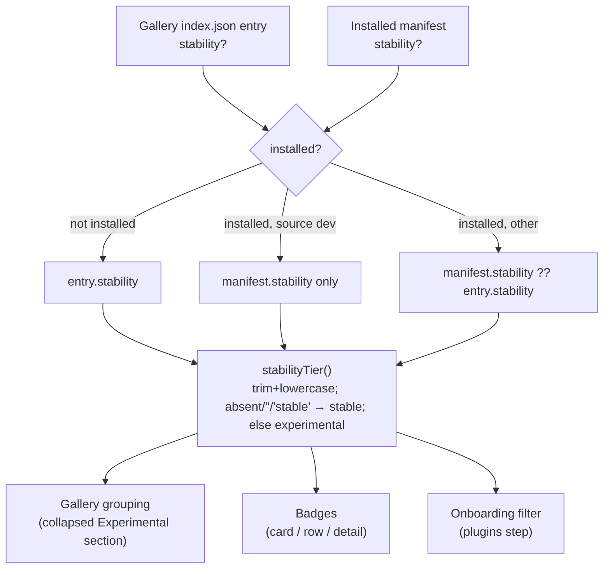

# feat: Plugin stability status (experimental tier)

## Summary

Add an optional `stability` string field to plugin gallery entries and plugin manifests, classified by one shared helper into stable or experimental tier. Experimental plugins get an "Experimental" badge in every Extensions render site, a collapsed "Experimental" gallery section with a disclaimer, exclusion from the onboarding wizard, and matching treatment on the marketing site's plugins page. p2p-sharing and tidal-browse are the first plugins marked.

---

## Problem Frame

The gallery presents every plugin identically, so pre-release plugins like p2p-sharing and tidal-browse read as finished features — creating wrong expectations, support noise, and lock-in against redesign or removal (see origin: docs/brainstorms/2026-07-10-plugin-stability-status-requirements.md). No maturity concept exists today; the nearest signals are `recommended` (promotion) and `debugOnly` (developer gate).

---

## Requirements

**Data model** (origin R1–R3, refined)

- R1. A plugin's maturity is an optional `stability` string field on gallery entries and manifests; absent means stable.
- R2. The field lives in both the gallery index entry (pre-install presentation, onboarding) and the plugin manifest (installed-copy display), mirroring how `version`/`minAppVersion` display metadata already dual-home.
- R3. Classification is fail-safe: after trim + lowercase, `""`/`"stable"`/absent are stable-tier; every other value (including unknown future values like `"beta"`) is experimental-tier. The rendered label is always "Experimental" — arbitrary index strings are never echoed into the UI.
- R10. Installed plugins whose manifest lacks the field inherit the gallery entry's stability (manifest wins when present; `dev`-source plugins are exempt from the gallery fallback).

**Gallery presentation** (origin R4–R6)

- R4. Experimental plugins render only inside a collapsed "Experimental" section at the bottom of the gallery list; collapse is unpersisted local state, and the section is hidden entirely when it has no entries.
- R5. The expanded section carries a one-line disclaimer that these plugins may break, change, or be removed.
- R6. Experimental plugins show an "Experimental" badge in all three plugin render sites (card, row, detail pane), in both the gallery and installed sections.
- R11. When the search query matches entries inside the Experimental section, the section auto-expands; the "Available" section header is hidden when it is empty and experimental entries exist.

**Onboarding** (origin R7)

- R7. Experimental plugins never appear in the onboarding wizard's plugin step — the same filtered list feeds the rendered rows, the pre-selection, and the install set. When filtering empties the list, the step shows a neutral "nothing to recommend" state, not the gallery-unreachable error.

**Installed copies** (origin R8)

- R8. Marking a plugin experimental changes nothing about installed copies beyond the badge: enable state untouched, no install/enable warning, auto-update continues.

**Marketing site**

- R12. The site's plugins page (`docs/js/gallery.js`), which renders the same `index.json`, presents experimental entries as such (badge or separate group) so the site and the app tell the same story.

**Initial rollout** (origin R9)

- R9. p2p-sharing and tidal-browse are marked experimental in the gallery index and, via their next releases, in their manifests (see Operational Notes).

---

## Key Technical Decisions

- **One shared classifier, three consumers.** A pure `stabilityTier(value?)` helper is the only place the stable/experimental rule lives; gallery grouping, badges, and onboarding all call it. Three call sites with inline comparisons is where the fail-safe rule would drift.
- **Fail-safe direction is closed, not open.** Unknown values classify as experimental (origin R3). Note this is the opposite of the onboarding-profiles precedent (unknown profile falls back to `normal`) — do not copy that fallback shape.
- **Gallery fallback for installed badges.** Installed items resolve `manifest.stability ?? galleryEntry.stability`. Without this, installed p2p/tidal copies show no badge until those repos ship releases — a months-long window where the gallery and the installed list disagree. Dev-source plugins are exempt (a local dev manifest is the developer's source of truth). Promotion to stable therefore requires both the index edit and a plugin release dropping the field.
- **Filter once, upstream.** Onboarding excludes experimental entries at the point where the entries list enters the plugins step, so the rendered rows, `computeInitialSelection`, and the install set can never disagree (filtering only pre-selection would still render the row; filtering only the render could still install an invisible checked entry).
- **Section exclusion happens before the recommended/fallback split.** ExtensionsView's "Available" section falls back to *all* not-installed entries when none are recommended — experimental entries must be removed from that pool first or they re-leak into the main list.
- **Existing patterns only.** Badge extends the `.ext-badge--*` family using the `--warning`/`--warning-rgb` skin tokens; disclaimer reuses `.ds-banner--warning`; collapse mirrors the unpersisted chevron pattern (`.section-header`/`.section-chevron`, as in InformationSections). No Rust changes — both the gallery index and manifests pass through the backend as untyped JSON (verified).

---

## High-Level Technical Design

Stability source resolution and fan-out:

---

## Implementation Units

### U1. Stability classifier and type plumbing

- **Goal:** One pure helper classifies stability values; the field flows from gallery entries and manifests into `ExtensionItem`.
- **Requirements:** R1, R2, R3, R10
- **Dependencies:** none
- **Files:** `src/utils/pluginStability.ts` (new), `src/types/plugin.ts`, `src/hooks/useExtensions.ts`, `src/__tests__/pluginStability.test.ts` (new)
- **Approach:** Add `stability?: string` to `PluginManifest`, `GalleryPluginEntry`, and `ExtensionItem` (beside `recommended`). `pluginStability.ts` exports `stabilityTier(value?: string): "stable" | "experimental"` and a convenience `isExperimental(value?)`. In `useExtensions`, installed items resolve `manifest.stability ?? galleryEntryById?.stability` (skip the fallback when `source === "dev"`); not-installed gallery items take `entry.stability` directly. Note the gallery cache (`galleryPluginsCache`) hydrates before the first fetch, so stability appears once a fresh index is fetched — absent-means-stable covers the stale window.
- **Patterns to follow:** the `profiles` field addition (see `docs/superpowers/specs/2026-07-04-onboarding-profiles-design.md`) — optional field, frontend-only parsing, back-compat by absence.
- **Test scenarios:**
  - `stabilityTier(undefined)` and `stabilityTier("")` → stable.
  - `stabilityTier("stable")`, `stabilityTier(" Stable ")` → stable (normalization).
  - `stabilityTier("experimental")` → experimental.
  - Covers AE3. `stabilityTier("beta")` and `stabilityTier("garbage")` → experimental (fail-safe).
  - Fallback: manifest without field + gallery entry `"experimental"` → experimental for builtin/user source; same inputs with `dev` source → stable.
  - Manifest `"stable"` + gallery `"experimental"` → stable (manifest wins).
- **Verification:** unit tests pass; `npx tsc --noEmit` clean.

### U2. Experimental badge in Extensions surfaces

- **Goal:** Experimental plugins are visibly badged wherever plugins render.
- **Requirements:** R6
- **Dependencies:** U1
- **Files:** `src/components/ExtensionsView.tsx`, `src/App.css`
- **Approach:** Render the badge in the three sites that already show the `recommended` badge: `PluginCard` name line, `PluginRow` first line, `PluginDetail` header — in the same relative position at all three (after any DEV/Recommended badge, before the status badge). Add `.ext-badge--experimental` to the existing `.ext-badge--*` family using `var(--warning)` / `rgba(var(--warning-rgb), …)` — never hardcoded colors. Unlike `recommended`, the badge shows on installed items too; since the gallery disclaimer is the only place its meaning is spelled out, give the badge a `title` tooltip carrying the same one-line disclaimer text everywhere it renders.
- **Test scenarios:** Test expectation: none — presentational; the classification driving visibility is covered by U1. Verify manually across two skins (skin-compatibility rule).
- **Verification:** badge visible on an experimental gallery card, row, and detail pane; visible on an installed experimental plugin; absent on stable plugins.

### U3. Collapsed Experimental gallery section

- **Goal:** Experimental plugins live in a collapsed, disclaimed section at the bottom of the gallery, and never leak into the main list.
- **Requirements:** R4, R5, R11
- **Dependencies:** U1
- **Files:** `src/components/ExtensionsView.tsx`, `src/utils/pluginStability.ts`, `src/__tests__/pluginStability.test.ts`, `src/App.css`
- **Approach:** Partition the not-installed set from `filtered` into discover (stable) and experimental via a pure helper (e.g. `partitionByStability(items)`) exported from `pluginStability.ts` for testability. The recommended-only/"Available"-fallback logic operates on the stable pool only. Render the Experimental section last: `SectionHeader` extended with an optional chevron + collapsed state (local `useState(true)`, mirroring InformationSections), count in the header, `.ds-banner--warning` disclaimer inside the expanded body, entries via the existing `renderPluginCollection` (covers both `pluginViewMode`s). Hide the section when empty; auto-expand while the search query is non-empty and the section has matches; hide the empty "Available" header when experimental entries are the only not-installed ones, moving its "Browse all ↗" action onto the Experimental header in that state. `showGallerySkeleton` / `showGalleryError` currently key on the discover pool being empty — re-gate both on the whole not-installed pool (discover + experimental) being empty, so skeletons and the error banner never render above a populated Experimental section.
- **Test scenarios:**
  - Covers AE1. Partition: mixed list → experimental entries separated from discover pool; recommended experimental entry does not appear in the recommended pool.
  - Zero experimental → empty experimental partition (section hidden).
  - All experimental → discover pool empty (Available header hidden).
- **Verification:** with the index carrying `stability: "experimental"` for two entries, the gallery shows them only inside the collapsed section; expanding shows disclaimer + cards; searching "tidal" auto-expands; clearing search re-collapses or keeps state (either acceptable, collapse is unpersisted).

### U4. Onboarding exclusion and empty-state fix

- **Goal:** Experimental plugins never surface in the onboarding wizard, and an all-filtered gallery doesn't show a false error.
- **Requirements:** R7
- **Dependencies:** U1
- **Files:** `src/components/OnboardingWizard.tsx`, `src/components/firstRunSelection.ts`, `src/__tests__/firstRunSelection.test.ts`
- **Approach:** The plugins step keeps receiving the raw entries prop and derives the visible list internally once (`visibleEntries = filterOnboardingEntries(entries)`, a pure helper in `firstRunSelection.ts` using `stabilityTier`), so rendered rows, `computeInitialSelection`, and `computeInstallEntries` all consume the same filtered list while the raw count stays in scope. The empty-state branch then distinguishes the two cases: raw-empty → existing "gallery unreachable" retry message; raw-nonempty + filtered-empty → neutral "nothing to recommend" copy, no Retry.
- **Test scenarios (extend `src/__tests__/firstRunSelection.test.ts` using its `entry()` factory):**
  - Covers AE1. Experimental + `recommended: true` → excluded from the filtered list and from initial selection.
  - Experimental + matching `profiles` → excluded.
  - Stable entries unaffected; empty input → empty output.
- **Verification:** re-run the wizard (Settings → General → Setup Wizard) with a test index: experimental entries absent from the plugin step; an index of only experimental entries shows the neutral empty state.

### U5. Marketing site plugins page

- **Goal:** viboplr.com/plugins.html tells the same story as the app once the index is edited.
- **Requirements:** R12
- **Dependencies:** none (parallel to U1–U4; keyed on the same index.json shape)
- **Files:** `docs/js/gallery.js`, `docs/css/style.css` (if a badge style is needed)
- **Approach:** `gallery.js` fetches the same `index.json`; apply the same normalization rule (small duplicated classifier — the site is plain JS with no build step, so it can't import `src/`; comment the duplication) and group experimental entries under an "Experimental" heading below the main list, mirroring the page's existing "Recommended" grouping, with the disclaimer rendered inline under the heading (same wording as the app). Experimental entries are removed from the Recommended and main groups — they render only in the Experimental group, matching the app's exclusion rule.
- **Test scenarios:** Test expectation: none — static marketing site with no test harness; verified by loading the page locally against a test index.
- **Verification:** page renders experimental entries visually distinct/grouped; entries without the field render unchanged.

---

## Acceptance Examples

- AE1. **Covers R4, R6, R7.** Given tidal-browse's gallery entry declares `stability: "experimental"`, the gallery shows it only inside the collapsed Experimental section with a badge, and the onboarding wizard's plugin step does not list it.
- AE2. **Covers R2, R6, R8, R10.** Given p2p-sharing is installed and enabled, once the host release ships and the index edit lands, the installed list shows the Experimental badge via the gallery fallback (no plugin release required); when viboplr-p2p later ships a manifest carrying the field, the badge is driven by the manifest instead. Enable state and auto-update are unaffected throughout.
- AE3. **Covers R3.** Given a future gallery entry declares `stability: "beta"` on this app version, it renders as experimental-tier with the label "Experimental" — never as stable, never echoing "beta".

---

## Scope Boundaries

- No warning or confirmation dialog on install/enable (origin decision — the section disclaimer is the consent moment).
- No defined behavior or distinct labels for `"beta"`/`"deprecated"`; they classify as experimental-tier until a future release recognizes them.
- No "show experimental plugins" setting; no persisted collapse state.
- Skins gallery untouched.

### Deferred to Follow-Up Work

- A "Stability" row in PluginDetail's Information grid (badge in the detail header covers the need for now).
- Convention note for future built-in experimental plugins: pair `stability` with `autoEnable: false` so first-launch auto-enable doesn't switch them on (no built-in experimental plugins exist today).

---

## Risks & Dependencies

- **Three-repo rollout** (host, `outcast1000/viboplr-plugins`, plugin repos) — sequencing below. Old app versions ignore the field and show experimental entries as stable; the index edit alone changes nothing for them.
- **`minAppVersion` hazard:** the p2p-sharing and tidal-browse manifest releases must NOT bump `minAppVersion` for a stability-only change, or users on older apps stop receiving updates (the field is ignored harmlessly there). This matters most for p2p-sharing, whose `minAppVersion` deliberately gates `api.p2p.*` compatibility.
- **Gallery cache staleness:** `galleryPluginsCache` means stability changes appear after the next successful index fetch — acceptable lag, no action.
- Stale rules docs mention `addLog()` for feedback; the live pattern is `useToasts().notify()` — this feature needs no user feedback calls, but don't reintroduce `addLog` from the docs.

---

## Documentation / Operational Notes

**Docs to update in this repo:** `.claude/rules/plugins.md` — add `stability` to the manifest format and gallery `index.json` entry documentation, including the fail-safe classification rule.

**Rollout order (after this plan ships in a host release):**

1. Edit `index.json` in `outcast1000/viboplr-plugins`: add `"stability": "experimental"` to the p2p-sharing and tidal-browse entries. Live immediately; pre-release apps ignore it; the site (U5, deployed with the host repo's docs) picks it up on the same fetch.
2. In `outcast1000/viboplr-p2p` and `outcast1000/viboplr-tidal`: add `"stability": "experimental"` to `manifest.json` in their next releases (no `minAppVersion` bump). Auto-update delivers within ~24h.
3. Promotion to stable later = remove the field from the index entry **and** ship a plugin release without it (manifest wins while present).

---

## Sources

- Origin requirements: `docs/brainstorms/2026-07-10-plugin-stability-status-requirements.md`
- Field-addition precedent: `docs/superpowers/specs/2026-07-04-onboarding-profiles-design.md` (profiles), `docs/superpowers/specs/2026-05-31-gallery-index-only-design.md` (gallery architecture, display-vs-authoritative metadata)
- `src/components/ExtensionsView.tsx` — `StatusBadge`, `SectionHeader`, `renderPluginCollection`, the `filtered`/`available`/recommended-fallback memos, `PluginCard`/`PluginRow`/`PluginDetail` badge sites
- `src/hooks/useExtensions.ts` — `ExtensionItem` construction (installed from manifests, not-installed from gallery entries)
- `src/hooks/usePlugins.ts` — `fetchPluginGallery`, `galleryPluginsCache`
- `src/components/firstRunSelection.ts` + `src/__tests__/firstRunSelection.test.ts` — onboarding selection logic and its test factory
- `src/App.css` (`.ext-badge` family, `.section-header`/`.section-chevron`), `src/design-system.css` (`.ds-banner--warning`), `src/types/skin.ts` (`--warning` token)
- `docs/js/gallery.js` — site rendering of the same index
